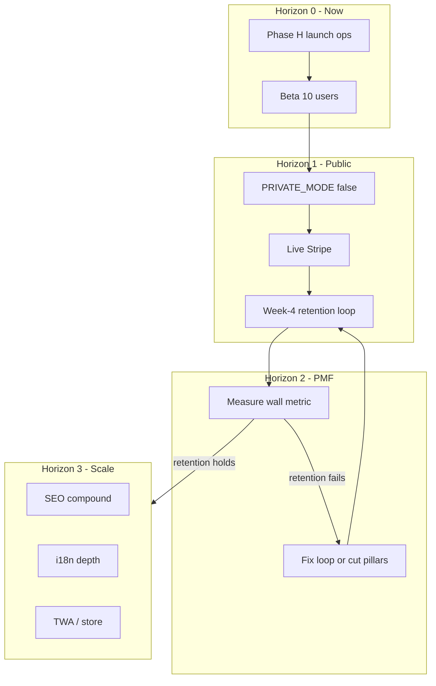

# Mission Winning — Long-Term Orchestration

**Audience:** Founder + AI agents  
**Build baseline:** `2026.07-unified.58`+  
**#1 metric (year one):** week-4 retained weekly loggers — [STRATEGY.md](STRATEGY.md)  
**Constitution:** [vision.md](vision.md) · **Risk filter:** [REDTEAM.md](REDTEAM.md) · **Build phases:** [PLAN.md](PLAN.md)

Use this file to decide **what to work on next** and **what is forbidden until metrics unlock**.  
Do not use old chat plans as source of truth — prefer this file + PLAN + LOG.

---

## Where we are (2026-07-14)

**Product code is strong.** Free core, six pillars, Mission Coach, Fuel Coach, journey, design system, security perimeter, SEO surfaces, freemium plumbing. S-Tier waves 0–4 shipped (pricing single source, first-hour polish, victory ritual, selective page decomp, token pass).

**Market is not.** Phase **H** founder-blocked: private mode, beta cohort incomplete, live Stripe env incomplete, PWA offline promise off until public.

---

## Principles

1. **Distribution before decoration** — no major features while beta gates fail (except hero bugs / launch unblock).
2. **Train + Fuel + Today are the product** — other pillars free-usable; premium depth expands after week-4 retention holds.
3. **One boss metric** — week-4 retained weekly loggers. Languages, pillars, stars alone are vanity.
4. **Two workstreams** — Founder (users, money, legal) and Agents (code, tests, perf, docs) in parallel; agents never mark founder work done.
5. **Selective rebuild only** — decompose fat modules; no framework rewrite.
6. **Vision filter** — free core never gated; America/school flag-off until a real channel.

---

## Horizon 0 — Launch unblock (days 0–14)

**Owner:** Founder primary · Agents: bugfix + launch docs/scripts only.

### Founder critical path

| # | Task | Doc |
|---|------|-----|
| 1 | Vercel Production: `SUPABASE_SERVICE_ROLE_KEY`, `DEMO_PREMIUM=false`, rotated `PRIVATE_ACCESS_SECRET` | [LAUNCH_RUNBOOK.md](LAUNCH_RUNBOOK.md) §2 |
| 2 | Stripe monthly / 12-mo $59 / lifetime $149 links + `STRIPE_WEBHOOK_SECRET` | [docs/STRIPE_PREMIUM_SETUP.md](docs/STRIPE_PREMIUM_SETUP.md) |
| 3 | Recruit ≥10 beta users | [STRATEGY.md](STRATEGY.md), [BETA_INVITE.md](BETA_INVITE.md) |
| 4 | Gates: I-Day ≥80%, Basic Training ≥60% | Profile beta panel, [PLAN.md](PLAN.md) F4 |
| 5 | Mobile hero QA: Welcome → Just Go → set → Mission Score | Manual + `npm run e2e:critical` |
| 6 | `LAUNCH_STRICT=true npm run launch-verify` against prod | Scripts |

### Agent-allowed (Horizon 0 only)

- Hero-flow / gate / premium 403 regressions
- Beta invite / founder panel / launch-verify clarity
- Keep CI green

**Done when:** 10+ profiles, BT ≥60%, secrets green, ready to flip public.

---

## Horizon 1 — Public + revenue (days 15–45)

| Track | Tasks |
|-------|--------|
| **Public** | `PRIVATE_MODE=false`; offline + `/offline` smoke; Search Console; soft launch ([docs/SOCIAL_LAUNCH.md](docs/SOCIAL_LAUNCH.md), [docs/SOFT_LAUNCH_DAY.md](docs/SOFT_LAUNCH_DAY.md)); Upstash in prod optional |
| **Money** | Stripe → `enrollments` E2E; waitlist → founders email; support FAQ |
| **Eng (bounded)** | Lighthouse `/` + `/log` ≥90; Serwist replace `next-pwa`; sync conflict tests; logger E2E depth; ActiveWorkout extract; `src/lib` domain folders |

**Done when:** Public without password; offline core works; ≥1 paid path verified; PostHog activation baselined.

---

## Horizon 2 — Retention / PMF (days 46–90)

**Wall metric:** week-4 retained weekly loggers — measure via [docs/POST_LAUNCH_CADENCE.md](docs/POST_LAUNCH_CADENCE.md).

If &lt;10% across two cohorts → **stop acquisition**, 10 interviews, fix or cut ([REDTEAM.md](REDTEAM.md) A4).

| Cadence | Action |
|---------|--------|
| Weekly | Wall metric + 1h user calls → copy fixes &lt;48h |
| Biweekly | REDTEAM A1–A5 status |
| Monthly | Pricing / refund / support themes |

### Product bets (only if retention directionally OK)

| Bet | Kill if |
|-----|---------|
| Coach as default habit | Coach open rate &lt;5% |
| Post-workout ritual polish | No fuel/mind after victory |
| Email nudge quality | Unsub &gt;5% or open &lt;15% |
| Form media top-20 | Cost without retention lift |

### Cut options if A3/A4 fire

Park Move/Mind/Learn chrome for Basic; keep America off; pause i18n; one-time programs if sub conversion &lt;2%.

---

## Horizon 3 — Scale (post-PMF only)

Unlock **only after** week-4 retention holds.

| Area | Work |
|------|------|
| **Acquisition** | SEO v2; Shorts system; es/pt/id body for Train+Fuel+Today; founder community |
| **Platform** | Android TWA if PWA install fails A1; web push after install base; wearables last; native last |
| **Premium / B2B** | Per-pillar unlocks; human coaching ops; school/America with legal; teams later |
| **Engineering** | Observability; CSP/Upstash; coverage on coach/fuel/sync; token lint CI |

---

## Standing queues (horizon-gated)

- Quality: hero Playwright, premium 403 matrix, sync fuzz, ErrorState, a11y quarterly  
- Perf: Today/Active/Landing budgets; lazy charts/catalog  
- Trust: original Learn wording (A9); real quotes only; help FAQ from support  
- Docs: PLAN / VISION_STATUS / LOG / build label on every ship  

---

## Do-not-build (until unlock)

| Item | Unlock |
|------|--------|
| New pillars | Vision amendment |
| Gate free logger | Never |
| Full locale body parity | Week-4 holds + beachhead locale |
| Native iOS | TWA/PWA insufficient |
| Wearables as primary score | Retention + sensor strategy |
| America/MAHA marketing | Legal + school channel |
| Paid ads | Organic funnel known |
| Greenfield rewrite | Never as default |
| Features while beta gates red | Only hero bugs / launch unblock |

---

## Role split

| Role | Owns |
|------|------|
| **Founder** | Users, pricing, Stripe/LLC, legal, launch posts, interviews, `PRIVATE_MODE` flip |
| **Agents** | Code within horizon gates, tests, perf, selective refactors, docs, CI |
| **Both** | Post-call fixes &lt;48h; wall metric review |

**Agent rule:** refuse or escalate feature requests that violate horizon gates unless the founder explicitly overrides with risk acceptance.

---

## 90-day calendar

| Week | Founder | Agents |
|------|---------|--------|
| 1–2 | Secrets, Stripe, 10 invites, hero phone QA | Bugfix; launch-verify |
| 3–4 | Follow-ups; BT gate | PWA/Serwist spike; Lighthouse |
| 5–6 | Soft launch; founders offer | Public mode; SEO Console; perf ≥90 |
| 7–10 | User calls; wall metric | Retention loop only |
| 11–13 | Go/no-go Horizon 3 | Unlocked scale items only |

---

## Success scorecard

| Horizon | Pass |
|---------|------|
| **0** | ≥10 beta, BT ≥60%, secrets + Stripe path verified |
| **1** | Public + offline core + ≥1 paid path + activation baselined |
| **2** | Week-4 ≥10% (two cohorts) **or** explicit pivot |
| **3** | SEO/i18n/TWA/B2B only with retention; free core still free |

---

## Related

- Build phases A–I detail: [PLAN.md](PLAN.md)  
- Vision scorecard: [VISION_STATUS.md](VISION_STATUS.md)  
- Post-launch metric SQL: [docs/POST_LAUNCH_CADENCE.md](docs/POST_LAUNCH_CADENCE.md)  
- Shipped chronology: [LOG.md](LOG.md)  
