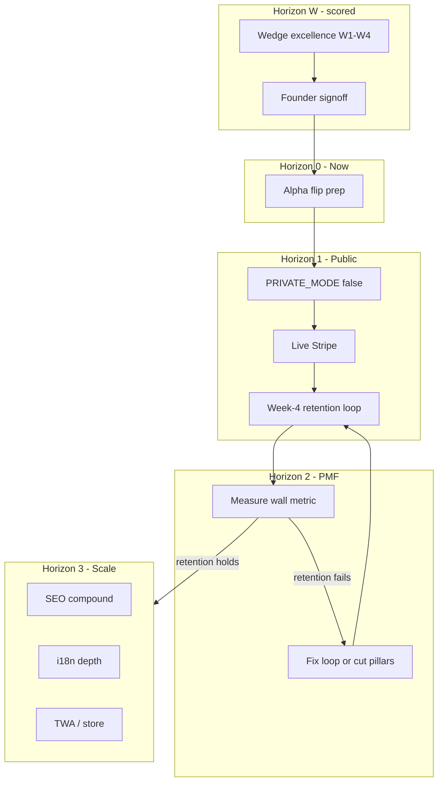

# Mission Winning — Long-Term Orchestration

**Audience:** Founder + AI agents  
**Build baseline:** live label in [CONTEXT.md](CONTEXT.md) `## Now` — do not restamp it here  
**#1 metric (year one):** week-4 retained weekly loggers — [docs/THESIS.md](docs/THESIS.md)  
**Constitution:** [vision.md](vision.md) · **Wedge / public truth:** [docs/THESIS.md](docs/THESIS.md) · **Crypto = rail:** [docs/CRYPTO_RAILS_THESIS.md](docs/CRYPTO_RAILS_THESIS.md) · **Risk notes:** product stubs + private mission-ops (`strategy/REDTEAM`) · **Build phases:** [docs/PLAN.md](docs/PLAN.md) · **Launch:** [docs/LAUNCH_RUNBOOK.md](docs/LAUNCH_RUNBOOK.md)

Use this file to decide **what to work on next** and **what is forbidden until metrics unlock**.  
Do not use old chat plans as source of truth — prefer this file + PLAN + LOG.

---

## Where we are

**Status lives in exactly one place: [CONTEXT.md](CONTEXT.md) `## Now`.** Update it there on every ship (same commit as the LOG entry) — do not restate status here. Founder launch detail: [docs/LAUNCH_RUNBOOK.md](docs/LAUNCH_RUNBOOK.md).

### Founder override — full launch (2026-08-05)

**Launch with everything** — agents may build full product surface (including **Mission Rewards** XP/ranks/badges, leaderboard honesty, pillar completeness). Wedge excellence remains required; free logger never gated.

| Still required | Still forbidden |
|----------------|-----------------|
| Horizon W excellence criteria on phone | Gate free logger |
| Free-first mute pay until EIN | Agents invent traction or flip `PRIVATE_MODE` |
| Honest empty states / no wallpaper unlocks | America/wearables without enable or legal |
| One concern per PR; ship protocol | Fake leaderboard humans without Pacer label |

Rewards domain: `src/lib/rewards/`. Session plans (`.hermes`, `~/.grok/sessions`) are not product truth.

### Founder override — www surface on Astro (2026-08-09)

**"Landing redesign" is no longer agent-forbidden.** Agents may build the **public marketing site** as a static Astro + Tailwind tree at `sites/www/`, deployed to Cloudflare Pages, per [docs/DESIGN_PROPOSAL_WWW.md](docs/DESIGN_PROPOSAL_WWW.md). Handoff `design_handoff_www_static` is **commissioned** — it is a fourth surface, not a revision of the desktop or mobile app.

| Still required | Still forbidden |
|----------------|-----------------|
| Tokens **generated** from `src/index.css` — never a second source | Moving any of the ~250 SEO URLs (they stay in Next.js this handoff) |
| One red action per page, **measured** not asserted | IA changes, route renames, token changes |
| Renders complete with JavaScript disabled | Agents invent traction or flip `PRIVATE_MODE` |
| One concern per PR; ship protocol | Gate the free logger |

Scope note: this override is **narrow by design**. Everything else on the Horizon W forbidden list below stays forbidden.

### Founder override — pre-EIN craft window (2026-08-03)

**The 10-invite beta program is retired.** Current release is **Alpha 0.1.0** — free tracker or Super Bundle (checkout muted until EIN). Beta is a later stage after public + week-4, not a harness ticket. EIN/payments may take weeks — use the window to keep building the wedge, www, and flip-prep.

| Still required | Still forbidden |
|----------------|-----------------|
| Horizon W excellence (phone path, no AI slop) | Gate free logger |
| Free-first mute pay until EIN | Agents invent traction or flip `PRIVATE_MODE` |
| One concern per PR; ship protocol | America marketing without legal; wearables as score; iOS before Android Accept B |

Agents may ship beyond “hero bugs only” for this window. Prefer delete/refine over new pillars.

### Founder override — six-stage hop pipeline (2026-08-17)

**Hop shape, not a new loop.** No GRAPH_LOOP letter. Store intel is closed (ops brain). Same stack (Next.js + tokens). Fable 5 means Claude Fable 5 as the **frontend implementer**. It is not a framework and not a rewrite. Principle 5 still holds.

**Train table is shipped** (`.889`). **Today is Summary** (`.912`) — pin-grid, one Start, every phase. Dashboard is not `/log`.

**Six stages** (surface hops: Train / Today / Victory / Coach pixels, or any athlete-facing UI):

| # | Stage | Do |
|---|--------|----|
| 1 | Realtime research | Re-read the matching ops intel pattern and/or walk *our* 390 screen. Skip if that pattern is already warm. Names stay in ops. Not a second queue. |
| 2 | Planning | One sentence claim + accept command in `docs/harness/HOP.md`. |
| 3 | Day-to-day code | Smallest product change. |
| 4 | Write & run tests | Recipe 16 — **before** the first product edit. `test_written: yes`. |
| 5 | Complex code/debug | Only if the accept bar stays red after a fair try, or the defect crosses domains. |
| 6 | Front end | Recipe 17. Token-only. 390×844 stills vs the bar. Re-run the **same** accept command. A screenshot is not PASS. |

Order:

```
(ops stills if needed) → HOP claim → test written & run
  → daily code → (complex only if stuck) → Fable 5 pixels → same accept
```

| Still required | Still forbidden |
|----------------|-----------------|
| Accept command is a real test | Greenfield rewrite / second frontend stack |
| Phone 390 is the product surface | Video membership, class CMS, TV / watchOS apps |
| Free logger never gated | Community feed; founder-face content |
| Nameless public git | Studio / rival names in product docs |
| Intel closed unless a claim has zero stills | Wave 8 of apps; research as a standing campaign |

**Growth grain** (social prep, not a product pivot). Full copy: [docs/SOCIAL_LAUNCH.md](docs/SOCIAL_LAUNCH.md) § Grain.

| Grain | Means | Not now |
|-------|--------|---------|
| App-first | Phone 390 is the gym. www is the funnel. | A second app shell |
| Open → today → Start | Today *is* the calendar. One red Start. | A class timetable |
| Named monthly hook | Later: one named week as a social object (copy + Coach week). | A Challenges pillar |
| Welcome + free guide | Email + existing Beyond the Basics reader (no download). | A new manuscript |
| Watch drop-off | Week-4 retained weekly loggers. Win-back is founder email. | A community analytics suite |
| Social is the door | IG/TikTok → Alpha / **free logger**. Super Bundle is never the hook ([docs/SOCIAL_LAUNCH.md](docs/SOCIAL_LAUNCH.md) F-016). | Paid ads (still locked) |
| Faceless later | Generated or hired coaches. Never founder face. Horizon 3. | Video factory / player / studio CMS |

---

## Principles

1. **Wedge excellence before flip theater** — build Train → Today → Victory → Coach until the founder scores “not lame.” The 10-invite program is retired. Public is `PRIVATE_MODE=false`.
2. **Train + Mission Coach are the product** — other pillars stay free-usable; do not deepen them while the wedge feels weak.
3. **One boss metric (after public)** — week-4 retained weekly loggers. Languages, pillars, stars alone are vanity.
4. **Two workstreams** — Founder (users, money, legal, excellence sign-off) and Agents (wedge code, tests, perf, docs) in parallel; agents never mark founder work done.
5. **Selective rebuild only** — decompose fat modules; no framework rewrite.
6. **Vision filter** — free core never gated; America/school flag-off until a real channel.



---

## Horizon W — Wedge excellence (scored 2026-08-16 · founder override 2026-07-23)

**Owner:** Agents build · Founder scores pass/fail on phone.

**Excellence criteria (all required):**
1. One-thumb set logging outdoors
2. One clear next session on Today (train / resume)
3. Coach week feels earned from logs (dose + adapt visible)
4. Missed day → re-entry without shame
5. Phone hero ≤90s feels intentional — not empty dashboard / six-pillar chore list

**Agent-required workstreams**

| Stream | Outcome |
|--------|---------|
| W1 Activation | I-Day → `/log` (Today, one Start); gear-matched session; no Mind modal on first missions |
| W2 One boss CTA | Basic = Train (+ soft Coach); Just Go does not lie; Commissioned demotes boards |
| W3 Logger + Victory | Slim set row; Victory stays in Coach/train loop |
| W4 Coach continuity | Free weekly generate/adapt; Bundle = voice/chat/regen depth |

**Agent-allowed:** All of the above + hero e2e + CI + LOG/CONTEXT sync.

**Agent-forbidden (unless explicit founder override):** New pillar depth, America/PFT, locale body farms, guidebook expansion, wearables, Android F5, YC thesis churn as daily work. — *`landing redesign` was struck 2026-08-09; see the [www surface override](#founder-override--www-surface-on-astro-2026-08-09) above, which is narrow and leaves the rest of this list intact.*

**Done when:** Founder phone path says pass → then Horizon 0 Alpha flip prep. RESULT is `pass` (2026-08-16). Harness tickets after that are the Horizon 0 path tickets, not a wedge walk.

**Where sign-off is written:** [docs/EXCELLENCE_RESULT.md](docs/EXCELLENCE_RESULT.md) — one home for `status: unscored | pass | fail`. `CONTEXT.md` `## Now` points at it in one bullet. Android Accept B stays separate ([apps/android/FOUNDER_ACCEPT.md](apps/android/FOUNDER_ACCEPT.md)).

**Agent stop-rule (process ratchet):** while RESULT status is not `pass`, PRs that change **surface** paths fail `npm run check-excellence-gate` / PR CI unless the commit (or PR body) carries `Excellence-Override: <reason>`. Wedge paths (Train / Today / Coach logger+plan) still ship. Hotfixes on surface need the trailer. Local `EXCELLENCE_OVERRIDE=1` is ignored in CI.

---

## Horizon 0 — Launch unblock (NOW · after excellence sign-off)

**Owner:** Founder primary · Agents: the path tickets below. Postal is later (you). There is no 10-invite beta — release is **Alpha 0.1.0**, offer is free tracker or Super Bundle. Residual wedge polish is founder dogfood ([LAUNCH_RUNBOOK](docs/LAUNCH_RUNBOOK.md) §3a), not an empty-queue walk.

### Path tickets

Closed checklist. Adding an H-id here without a `PATH_STEPS` row is red (`criticalPath.test.ts`). The first unproven row is the live `/harness` ticket.

| Ticket | Outcome |
|--------|---------|
| H01 Keep CI green | www composition floors pass (`npm --prefix sites/www run check`). Proven by `sites/www/COMPOSITION_PASS.md` (`status: pass`) — the check script existing is not the proof |
| H03 Alpha chrome | Athlete launch chrome says Alpha, not Free beta (`src/lib/alphaNavHonesty.test.ts`) |

### Founder critical path

| # | Task | Doc |
|---|------|-----|
| 0 | **`MAIL_POSTAL_ADDRESS`** — later. Invite email hard-blocked without it; not a build freeze | [docs/LAUNCH_RUNBOOK.md](docs/LAUNCH_RUNBOOK.md) §2 · CONTEXT status |
| 0b | Pending Supabase migrations (return loop / week-4 / push) | [docs/LAUNCH_RUNBOOK.md](docs/LAUNCH_RUNBOOK.md) §2–§3 |
| 1 | Vercel Production: `SUPABASE_SERVICE_ROLE_KEY`, `DEMO_PREMIUM=false`, rotated `PRIVATE_ACCESS_SECRET` | [docs/LAUNCH_RUNBOOK.md](docs/LAUNCH_RUNBOOK.md) §2 |
| 2 | Stripe monthly / 12-mo $59 / lifetime $149 links + `STRIPE_WEBHOOK_SECRET` — **after EIN** (mute-pay now) | [docs/STRIPE_PREMIUM_SETUP.md](docs/STRIPE_PREMIUM_SETUP.md), [docs/FREE_BETA.md](docs/FREE_BETA.md) |
| 3 | **Dogfood notes** on current build (2–5 min; paste #1 friction to agents) | [docs/LAUNCH_RUNBOOK.md](docs/LAUNCH_RUNBOOK.md) **§3a** |
| 4 | ~~Recruit ≥10 beta users~~ **Retired.** No invite-beta program. Release is Alpha 0.1.0. | — |
| 5 | **Gates (the one home for these numbers): I-Day ≥80%, Basic Training ≥60%.** Basic Training means **first workout completed** ([docs/JOURNEY.md](docs/JOURNEY.md) Phase 1) — Horizon W retired the 5/5 scavenger hunt. `.605`: this gate had carried three different values across three files (≥40% 5/5, ≥60% 5/5, first-workout-only); other docs now point here rather than restate. | Profile beta panel, [docs/JOURNEY.md](docs/JOURNEY.md) Phase 1 |
| 6 | Mobile hero QA: Welcome → first set → Victory → Coach (with dogfood notes) | Manual + `npm run e2e:critical` + §3a |
| 7 | `LAUNCH_STRICT=true npm run launch-verify` against prod | Scripts |
| 8 | Public flip day (after gates) | [docs/archive/SOFT_LAUNCH_DAY.md](docs/archive/SOFT_LAUNCH_DAY.md) + [docs/archive/PUBLIC_FLIP_CHECKLIST.md](docs/archive/PUBLIC_FLIP_CHECKLIST.md) |
| 9 | Ops maturity Wave A: Upstash + Sentry DSN + `SMOKE_BASE_URL` / `VERCEL_*` + backup drill | [docs/PRODUCTION_STACK.md](docs/PRODUCTION_STACK.md), [docs/BACKUP_RESTORE.md](docs/BACKUP_RESTORE.md) |

### Agent-allowed (Horizon 0)

- Hero-flow / gate / premium 403 regressions
- Launch-verify + **growth-smoke** clarity
- Keep CI green; docs match reality (build label, LAUNCH_READY)
- Public-flip offline/SW checklist maintenance
- Production-stack scorecard + rate-limit smoke script + backup runbook (no new pillars)
- Residual wedge polish
- Keep building until the flip — do not stall for postal or a retired invite count

**Done when:** Excellence already passed + flip checklist ready. Not 10+ profiles. Beta is a later stage after public + week-4.

---

## Horizon 1 — Public + revenue (days 15–45)

| Track | Tasks |
|-------|--------|
| **Public** | `PRIVATE_MODE=false`; offline + SW smoke ([docs/archive/PUBLIC_FLIP_CHECKLIST.md](docs/archive/PUBLIC_FLIP_CHECKLIST.md)); Search Console; soft launch ([docs/SOCIAL_LAUNCH.md](docs/SOCIAL_LAUNCH.md), [docs/archive/SOFT_LAUNCH_DAY.md](docs/archive/SOFT_LAUNCH_DAY.md)); Upstash + Sentry required in prod ([docs/PRODUCTION_STACK.md](docs/PRODUCTION_STACK.md) Wave A/B); **Lifetime vs Grok $ cap decided** ([LAUNCH_RUNBOOK](docs/LAUNCH_RUNBOOK.md) §5) |
| **Money** | Stripe → `enrollments` E2E; waitlist → founders email; support FAQ; do not sell $149 lifetime as unlimited Grok |
| **Eng (bounded)** | ~~Lighthouse `/` + `/log` ≥90~~ ✅; ~~Serwist~~ ✅; ~~sync conflict tests~~ ✅; ~~logger E2E depth~~ ✅; ~~ActiveWorkout / Today extract~~ ✅; ~~`src/lib/workout/` domain~~ ✅ |

**Done when:** Public without password; offline core works; ≥1 paid path verified; PostHog activation baselined.

---

## Horizon 2 — Retention / PMF (days 46–90)

**Wall metric:** week-4 retained weekly loggers — measure via [docs/POST_LAUNCH_CADENCE.md](docs/POST_LAUNCH_CADENCE.md).

If &lt;10% across two cohorts → **stop acquisition**, 10 interviews, fix or cut (REDTEAM A4 — full memo in private mission-ops).

| Cadence | Action |
|---------|--------|
| Weekly | Wall metric + 1h user calls → copy fixes &lt;48h |
| Biweekly | REDTEAM A1–A5 status |
| Monthly | Pricing / refund / support themes |

### Product bets (only if retention directionally OK)

| Bet | Kill if |
|-----|---------|
| Coach as default habit | Coach open rate &lt;5% |
| Post-workout ritual polish | No fuel/mind after victory |
| Email nudge quality | Unsub &gt;5% or open &lt;15% |
| Form media top-20 | Cost without retention lift |

### Cut options if A3/A4 fire

Park Move/Mind/Learn chrome for Basic; keep America off; pause i18n; one-time programs if sub conversion &lt;2%.

---

## Horizon 3 — Scale (post-PMF only)

Unlock **only after** week-4 retention holds.

| Area | Work |
|------|------|
| **Acquisition** | SEO v2; Shorts system; es/pt/id body for Train+Fuel+Today; founder community; **faceless** generated films or hired coaches as Learn/Coach depth (never founder face; not a membership CMS) |
| **Platform** | Android TWA if PWA install fails A1; web push after install base; wearables last; native last |
| **Premium / B2B** | Per-pillar unlocks; human coaching ops; school/America with legal; teams later |
| **Engineering** | Observability; CSP/Upstash; coverage on coach/fuel/sync; token lint CI |

---

## Standing queues (horizon-gated)

- Quality: hero Playwright, premium 403 matrix, sync fuzz, ErrorState, a11y quarterly  
- Perf: Today/Active/Landing budgets; lazy charts/catalog  
- Trust: original Learn wording (A9); real quotes only; help FAQ from support  
- Docs: LOG / CONTEXT.md `## Now` / build label on every ship — the three hard rule 5 *enforces* (`check-build-label`). `.605` removed `VISION_STATUS` from this line and archived it: a per-pillar scorecard is a second home for status, this line asked for it every ship, nothing checked it, and it went **495 ships** without an update while still reading as current. An unenforced item inside an enforced list is how the unenforced one dies. PLAN's phase table moves with the phase, not with every ship.  

---

## Do-not-build (until unlock)

| Item | Unlock |
|------|--------|
| New pillars | Vision amendment |
| Gate free logger | Never |
| Full locale body parity | **Founder unlocked 2026-07-19** — see `APP_LANGS` + `npm run i18n:parity` |
| Native iOS | TWA/PWA insufficient |
| Wearables as primary score | Retention + sensor strategy |
| America/MAHA marketing | Legal + school channel |
| Paid ads | Organic funnel known |
| Greenfield rewrite | Never as default |
| Features while beta gates red | **Waived 2026-08-03 (pre-EIN craft window)** — excellence still required; public flip still needs founder readiness |

---

## Role split

| Role | Owns |
|------|------|
| **Founder** | Users, pricing, Stripe/LLC, legal, launch posts, interviews, `PRIVATE_MODE` flip |
| **Agents** | Code within horizon gates, tests, perf, selective refactors, docs, CI |
| **Both** | Post-call fixes &lt;48h; wall metric review |

**Agent rule:** refuse or escalate feature requests that violate horizon gates unless the founder explicitly overrides with risk acceptance.

### Departments (agent lanes)

The agent half of the role split, refined into lanes. Every task belongs to exactly one lane; a session states its lane up front and stays inside the allowed paths. Cross-lane changes (e.g. an API change for Android) go through the owning lane's entry doc.

| Lane | Owner | Entry doc(s) | Allowed paths |
|------|-------|--------------|---------------|
| **Engineering-Web** | agents | [AGENTS.md](AGENTS.md) + `src/*/INDEX.md` | `app/`, `src/`, `packages/`, `scripts/`, `tests/` |
| **Engineering-Android** | agents | [apps/android/AGENTS.md](apps/android/AGENTS.md) | `apps/android/**` |
| **Engineering-iOS** | closed until gate | [docs/IOS_PLAYBOOK.md](docs/IOS_PLAYBOOK.md) | `apps/ios/**` (does not exist yet) |
| **Design / Brand** | agents, founder approves | [docs/DESIGN_ORCHESTRATION.md](docs/DESIGN_ORCHESTRATION.md) + [docs/brand-guidelines.md](docs/brand-guidelines.md) + [docs/DESIGN_SYSTEM.md](docs/DESIGN_SYSTEM.md) + [docs/DESIGN_REVIEW.md](docs/DESIGN_REVIEW.md) | `src/components/`, `src/index.css`, `public/brand/`, `apps/android/core/designsystem/`, `apps/android/UX.md`, `.claude/skills/` |
| **Content / Book** | agents; originality log mandatory | [docs/guidebook-originality-log.md](docs/guidebook-originality-log.md) + [docs/issa-source-map.md](docs/issa-source-map.md) | `src/data/guidebook/`, `docs/help/` |
| **Growth / SEO** | agents draft; founder posts | [docs/SOCIAL_LAUNCH.md](docs/SOCIAL_LAUNCH.md) + [docs/SEO_ANALYTICS.md](docs/SEO_ANALYTICS.md) + recipes 18–19 | `seo/`, `docs/` (nameless). Named intel only in `ops/intel/` |
| **Ops / Security** | founder + agents | [docs/PRODUCTION_STACK.md](docs/PRODUCTION_STACK.md) + [docs/PROTECTION.md](docs/PROTECTION.md) | `.github/`, `scripts/`, `supabase/` |
| **Data / Analytics** | agents | [docs/POST_LAUNCH_CADENCE.md](docs/POST_LAUNCH_CADENCE.md) | `scripts/`, `docs/` |

Founder-only lanes (never delegated): accounts/secrets, pricing, legal filings, launch posts, user interviews, `PRIVATE_MODE`.

---

## 90-day calendar

| Week | Founder | Agents |
|------|---------|--------|
| 1–2 | Secrets, Stripe, 10 invites, hero phone QA | Bugfix; launch-verify |
| 3–4 | Follow-ups; BT gate | PWA/Serwist spike; Lighthouse |
| 5–6 | Soft launch; founders offer | Public mode; SEO Console; perf ≥90 |
| 7–10 | User calls; wall metric | Retention loop only |
| 11–13 | Go/no-go Horizon 3 | Unlocked scale items only |

---

## Success scorecard

| Horizon | Pass |
|---------|------|
| **0** | Alpha flip-prep ready (checklist, secrets path); BT ≥60% is a later measure, not a freeze |
| **1** | Public + offline core + ≥1 paid path + activation baselined |
| **2** | Week-4 ≥10% (two cohorts) **or** explicit pivot |
| **3** | SEO/i18n/TWA/B2B only with retention; free core still free |

---

## YC application gate (Horizon: apply only after retention)

**Do not apply to YC (or claim traction) until all of the below hold.** Public summary: [docs/THESIS.md](docs/THESIS.md). Full YC memo: private mission-ops. Agents never flip `PRIVATE_MODE` or invent numbers.

| Gate | Target |
|------|--------|
| Real users | ≥100 completed ≥1 workout |
| Week-4 retained weekly loggers | ≥10% of activated cohort ([docs/THESIS.md](docs/THESIS.md)) |
| Paid signal | ≥10 Super Bundle or lifetime |
| Demo | 60s: I-Day → log → Coach adapts week |
| Interviews | 20 written “why I almost quit” notes |

**Founder path (order):** Alpha (gated, keep building) → public (`PRIVATE_MODE=false`) → week-4 + paid signal → later: beta as a stage, then YC only if numbers are rising.  
Measure: [docs/POST_LAUNCH_CADENCE.md](docs/POST_LAUNCH_CADENCE.md). Flip day: [docs/archive/SOFT_LAUNCH_DAY.md](docs/archive/SOFT_LAUNCH_DAY.md).

Pitch the **Train + Mission Coach wedge** — not “everything app.” Constitution stays [vision.md](vision.md).

---

## Related

- Build phases A–I detail: [docs/PLAN.md](docs/PLAN.md)  
- Agent graph execution queue (one loop per PR): [docs/GRAPH_LOOP.md](docs/GRAPH_LOOP.md)  
- Where we are: [CONTEXT.md](CONTEXT.md) `## Now` — the only status block ([docs/archive/VISION_STATUS-2026-07-23.md](docs/archive/VISION_STATUS-2026-07-23.md) is the retired scorecard)  
- YC wedge / apply bar: [docs/THESIS.md](docs/THESIS.md) (full apply pack → mission-ops)  
- Crypto rails (not product): [docs/CRYPTO_RAILS_THESIS.md](docs/CRYPTO_RAILS_THESIS.md)  
- Post-launch metric SQL: [docs/POST_LAUNCH_CADENCE.md](docs/POST_LAUNCH_CADENCE.md)  
- Shipped chronology: [LOG.md](LOG.md)  
