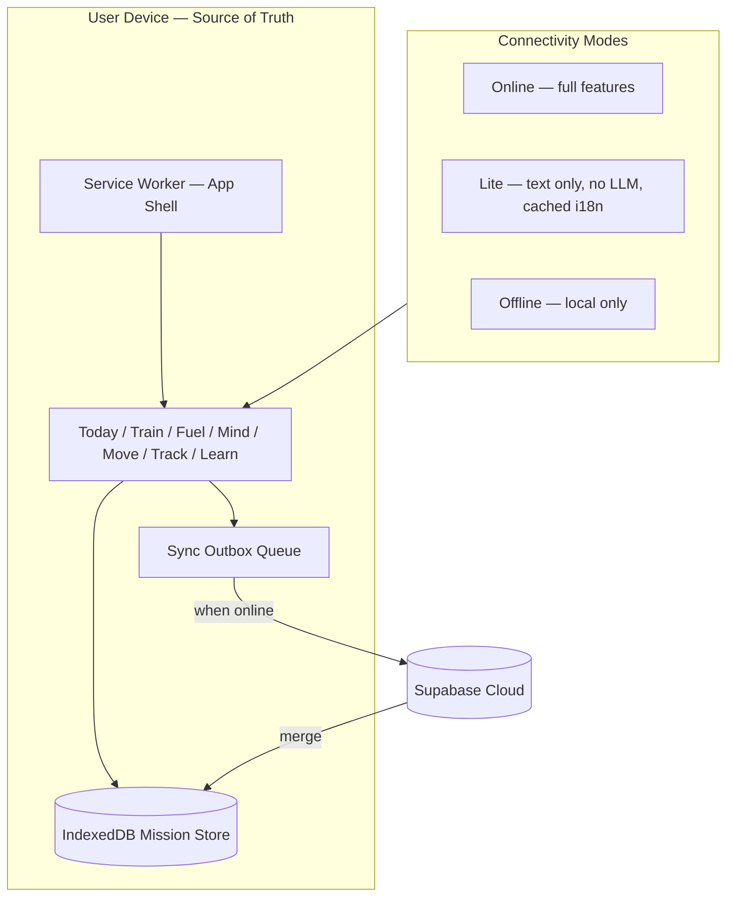
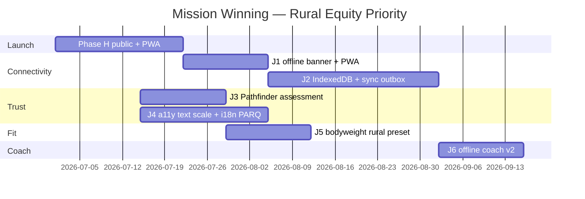

# Rural Equity & Connectivity Plan — Mission Winning

**Purpose:** Make Mission Winning the **world’s most usable free health app** for people who are **rural, low-income, offline, and far from a doctor** — without pretending to be a hospital, surgeon, or telehealth clinic.

**Authority:** Extends [vision.md](vision.md) · [VISION_STATUS.md](VISION_STATUS.md) · [PLAN.md](PLAN.md)  
**Last updated:** 2026-06-29

---

## 1. The problem we’re solving (and what we’re not)

### The Musk thesis (context)

Elon Musk’s recurring argument (2025–2026 interviews, including [Moonshots with Peter Diamandis](https://www.youtube.com/watch?v=RSNuB9pj9P8)) is structural:

> Great doctors and surgeons **don’t scale with money**. Geographic inequality, training time, and human limits mean rural communities wait months or travel hundreds of miles for specialists.

His proposed answer is **robotics + AI at scale** (Optimus, on-device/cloud AI) — “surgeons built in factories.”

### Mission Winning’s answer (complementary, not competing)

We do **not** diagnose disease, prescribe medication, or perform surgery. We **do** attack the upstream crisis:

| Crisis layer | Who fixes it today | Mission Winning role |
|--------------|-------------------|----------------------|
| Emergency surgery / specialist care | Hospitals, telehealth, (future) robotics | **Not us** — clear disclaimers, escalation only |
| Chronic disease from inactivity, poor nutrition, stress | Mostly unfunded | **Core mission** — free Train + Fuel + Move + Mind |
| “Should I exercise today?” without a PT | Nobody in rural areas | **AI Coach + assessments + text guides** (offline-capable) |
| Health literacy | Fragmented web | **Learn pillar** — ISSA-aligned, plain language |
| Youth / school fitness | PE teachers, PFT tradition | **Optional America track** — class codes, no doctor required |

**One-line positioning:**

> *Robots may one day scale surgery. Mission Winning scales **the path that keeps people from needing surgery** — free, offline, on any phone, in any village.*

This aligns with vision.md: *“The right path vs. destruction”* and *“Lagos, Moscow, Mumbai, rural areas.”*

---

## 2. North star — “Pathfinder for the disconnected”

### Design promise (2030 horizon)

A community health volunteer in rural Nigeria, a parent in Appalachia, or a teenager on a school bus with spotty LTE can:

1. **Install once** (PWA, &lt;5 MB critical path on 2G)
2. **Complete I-Day + PAR-Q without network**
3. **Train, log food, breathe, walk, learn** — fully offline for 30+ days
4. **See one clear next action** (Journey hero) — no doctor required
5. **Sync when a signal appears** — queued, invisible, never blocking
6. **Read everything in their language** — voice optional where literacy is low
7. **Never hit a paywall** on the life-saving basics

### Success metrics

| Metric | Target | Why |
|--------|--------|-----|
| **Offline session rate** | ≥40% of sessions complete with zero network | Proves rural usability |
| **Install on Android low-end** | PWA install success ≥70% on 2GB RAM devices | Equity hardware |
| **Assessment completion (offline)** | ≥85% finish PAR-Q without drop-off | Safety + onboarding |
| **Bodyweight program starts** | ≥60% of rural cohort (self-reported region) | Minimal equipment fit |
| **Sync recovery** | 100% of queued writes succeed within 7 days of connectivity | Trust |
| **i18n body coverage** | Tier 1 languages ≥80% on Today + Assessments + Active | “Everyone, everywhere” |

---

## 3. Competitive / research landscape

| Reference | Lesson for MW |
|-----------|---------------|
| [Offline-first African markets (Kalinko)](https://kalinkolabs.com/blog/offline-first-applications-african-markets/) | Local DB = source of truth; cache-first shell; background sync queue; 2G text-only mode |
| [Rural healthcare Android guide (Ahex)](https://ahex.co/offline-first-android-healthcare-apps/) | UI never waits on network; WorkManager-style retry; last-write-wins MVP |
| [Trij (open-source)](https://github.com/Mosss-OS/trij) | On-device triage for CHWs — **different scope** (clinical); borrow **offline PWA + IndexedDB + voice** patterns, not diagnosis |
| [Next.js PWA offline (LogRocket)](https://blog.logrocket.com/nextjs-16-pwa-offline-support/) | Serwist/Workbox + outbox sync pattern for Next 16 |
| **Bevel / Freeletics** | Metric UI + one next workout — already our UI north stars |

**Differentiation:** Trij = clinical triage. **Mission Winning = preventive fitness + health habits + education** — legal, scalable globally, free core forever.

---

## 4. Architecture — “Local-first Mission OS”

### Core technical deliverables

| ID | Deliverable | Description |
|----|-------------|-------------|
| **T1** | `MissionLocalStore` (IndexedDB) | Unified store: workouts, nutrition, activities, assessments, journey, pillar wins |
| **T2** | `SyncOutbox` + background sync | Queue writes; exponential backoff; “Synced ✓ / Pending · 3” indicator |
| **T3** | Connectivity profile | `navigator.connection` + manual “Lite mode” toggle on Profile |
| **T4** | PWA launch (Phase H) | Enable when `PRIVATE_MODE=false`; precache app shell + critical locales |
| **T5** | Low-data asset policy | No hero video; WebP; lazy images; optional “text-only exercises” |
| **T6** | Offline i18n bundle | Ship en+es+fr+pt+ar+hi+sw in first install cache; rest on demand |

---

## 5. Product workstreams & deliverables

### Workstream A — **Connectivity & offline (Phase J1–J2)**

**Problem today:** PWA disabled in prod; localStorage only; silent sync failures; no offline banner.

| Deliverable | User-visible outcome | Priority |
|-------------|---------------------|----------|
| **A1** Offline banner + sync pill | “You’re offline — everything still works” + pending count | P0 |
| **A2** IndexedDB migration from localStorage | Workouts/survive clear-cache; larger quota | P0 |
| **A3** Sync outbox for workouts + nutrition + journey | Queue on failure; flush on reconnect | P0 |
| **A4** Coach insight: rules-only offline pack | No LLM required; precomputed 30-day rotation | P1 |
| **A5** Lite mode | Disable leaderboard sync, barcode, photo meal, cloud coach | P1 |
| **A6** “Download for offline” on Learn paths + form guides | One-tap cache top 20 exercises + 3 learn paths | P1 |
| **A7** 2G QA suite | Playwright/ manual matrix: Slow 3G, offline, save-data | P1 |

---

### Workstream B — **Health without a doctor (Phase J3)**

**Problem today:** PAR-Q says “consult physician”; no path for users who **cannot** access one.

| Deliverable | User-visible outcome | Priority |
|-------------|---------------------|----------|
| **B1** **Pathfinder Assessment** (extends PAR-Q) | New final screen: “I can’t reach a doctor easily” → **self-managed track** | P0 |
| **B2** Risk-adaptive program gating | High risk → only low-impact flows unlock; clear “seek care when you can” | P0 |
| **B3** **Village Health Card** (printable HTML) | Symptoms to watch, completed workouts, assessment date — share with CHW/clinic when they visit town | P1 |
| **B4** Red-flag lexicon (i18n) | Chest pain, fainting, etc. → “get urgent care if possible” — not “call 911” US-only | P1 |
| **B5** Youth / school path without email | Offline parent consent code on paper (teacher holds list) — optional | P2 |
| **B6** Community referrer mode | CHW/school teacher dashboard lite (aggregate stats only, no PHI export) | P2 |

**Legal guardrails (non-negotiable):**

- Never claim diagnosis, treatment, or prescription
- Always: *“Educational fitness tool — not medical advice”*
- Escalation language localized, not US-centric (clinic, health post, emergency services if available)

---

### Workstream C — **Accessibility (Phase J4)**

**Problem today:** Partial RTL, no text scale, spotty aria, charts inaccessible.

| Deliverable | User-visible outcome | Priority |
|-------------|---------------------|----------|
| **C1** Text scale (Small / Default / Large / XL) | Profile toggle; rem-based | P0 |
| **C2** Skip link + focus order audit on Today/Active/Welcome | Keyboard + TalkBack usable | P0 |
| **C3** Assessment + Journey full i18n (Tier 1) | PAR-Q in es/fr/pt/ar/hi | P0 |
| **C4** Chart data tables (History, Benchmarks) | Screen reader alternative to Recharts | P1 |
| **C5** RTL pass on forms, sidebar, dialogs | ar/he/fa/ur | P1 |
| **C6** High contrast mode | WCAG AA on content cards | P2 |
| **C7** Voice read-aloud for Today hero + mind sessions | Web Speech API; offline where cached | P2 |

---

### Workstream D — **Rural UX & minimal equipment (Phase J5)**

**Problem today:** Marketing mentions rural; UX defaults to full gym; mixed starters.

| Deliverable | User-visible outcome | Priority |
|-------------|---------------------|----------|
| **D1** Welcome default = bodyweight everywhere | HomePage respects `mw_equipment=bodyweight` | P0 |
| **D2** “Rural / low equipment” journey preset | I-Day question: village, home, schoolyard → filters library | P0 |
| **D3** Today’s Workout: bodyweight-first rotation | No barbell WOD as default for new users | P1 |
| **D4** Fuel: offline manual food log | Drop barcode requirement; common foods list cached | P1 |
| **D5** Recipes tagged `low-resource-kitchen` filter | vision already seeds some — surface in Fuel UI | P1 |
| **D6** SMS/share sheet “weekly win” | Text-only share for 2G users (no image cards) | P2 |

---

### Workstream E — **AI Coach for the disconnected (Phase J6)**

**Musk-scale AI, MW-scale ethics:** On-device or cached rules first; cloud LLM optional enhancement.

| Deliverable | User-visible outcome | Priority |
|-------------|---------------------|----------|
| **E1** Offline coach rule engine v2 | Cross-pillar actions without API | P0 |
| **E2** “Plan generator” offline templates | 4-week bodyweight/mobility plans by goal | P1 |
| **E3** Optional on-device LLM path (future) | Evaluate WebLLM/Gemma for low-end Android — **research spike only** | P3 |
| **E4** Premium gate when live | Cloud AI + adaptive plans = Bundle; rules stay free | Phase I2 |

---

## 6. Phased roadmap — Phase J (Rural Equity)

Insert into [PLAN.md](PLAN.md) after Phase I:

| Sub-phase | Theme | Duration (engineering) | Depends on |
|-----------|-------|------------------------|------------|
| **J1** | PWA on + offline shell + banner | 1 sprint | Phase H launch |
| **J2** | IndexedDB + sync outbox | 2 sprints | J1 |
| **J3** | Pathfinder assessment + gating | 1 sprint | — |
| **J4** | a11y + assessment i18n | 2 sprints | — |
| **J5** | Rural preset + bodyweight defaults | 1 sprint | — |
| **J6** | Offline coach v2 + printable health card | 1 sprint | J2 |

**Parallel track:** Phase H (public launch) remains **prerequisite** for PWA — but J3–J5 can ship **while still gated**.

---

## 7. Design system additions (“Glorious rural UI”)

### Visual language

| Token | Intent |
|-------|--------|
| **Connection stripe** | Thin top bar: green (online), amber (lite), slate (offline) — always visible |
| **Sync halo** | Subtle pulse on Profile avatar when outbox &gt; 0 |
| **Pathfinder badge** | Compass icon on Journey strip for self-managed track users |
| **Bodyweight hero** | Photography/illustration: schoolyard, home, dirt road — not luxury gym |
| **Typography** | Respect `text-scale`; minimum 16px body; 44px touch targets (already HIG) |

### Key screens (wireframe intent)

1. **Welcome → “Where do you train?”** — Village / Home / School / Gym (icons, not text-only)
2. **Today (offline)** — Hero CTA + “Last synced 3 days ago — still counting your wins locally”
3. **Pathfinder result** — Three columns: *Safe to start* | *Start gentle* | *When you can reach care*
4. **Lite mode Profile** — Single toggle: “Use less data” with explanation

---

## 8. Foundation & partnerships (vision.md scholarships)

Deliverables for **Mission Winning Foundation** arm (ops, not code):

| Deliverable | Description |
|-------------|-------------|
| **F1** Scholarship API | Grant 12-month Bundle to verified schools/NGOs in target regions |
| **F2** CHW kit PDF | Printable teacher/CHW guide + class codes + offline install QR |
| **F3** Grant narrative | Align with global health funders: *prevention at scale*, not clinical AI |

---

## 9. What we will NOT build (scope fence)

- Diagnosis, triage of acute illness, or prescription suggestions
- Replacement for emergency services
- Claims of “better than a doctor” (Musk’s lane — robotics/AI medicine)
- Video-heavy library requiring CDN for free tier
- Doctor video visits or licensed telehealth (unless future partnership — separate product)

---

## 10. Recommended execution order (next 90 days of engineering)

**Immediate next 3 commits (highest glory per line of code):**

1. **Pathfinder track** on AssessmentsPage — “No regular doctor access” path + low-impact program lock
2. **ConnectivityProvider** — online/offline/lite + banner component on AppLayout
3. **Welcome equipment → HomePage filter** — bodyweight default chain fix

---

## 11. Document map

| Doc | Role |
|-----|------|
| [vision.md](vision.md) | Values & pillars — add § “Rural & offline” pointer |
| [VISION_STATUS.md](VISION_STATUS.md) | Scorecard — add Rural Equity row |
| [PLAN.md](PLAN.md) | Phase J registration |
| [PRE_LAUNCH_PLAN.md](PRE_LAUNCH_PLAN.md) | Phase H still gates PWA |
| **This doc** | Rural equity master plan |

---

## 12. One paragraph for donors, press, and Musk-curious skeptics

Mission Winning is building what money alone cannot buy in rural health: **daily access to evidence-based fitness, nutrition, mobility, and calm** — on a phone that works without signal, in a language you speak, with no subscription required. We are not replacing surgeons; we are widening the path so fewer people need one. When connectivity returns, your progress syncs. When a clinic visit is possible, your **Village Health Card** shows what you’ve built. That is how you scale health for everyone, everywhere — starting today, not in a factory.

---

*Review after Phase J1 ship or quarterly. Filter every feature: **Does this help someone with no doctor and no signal?***
