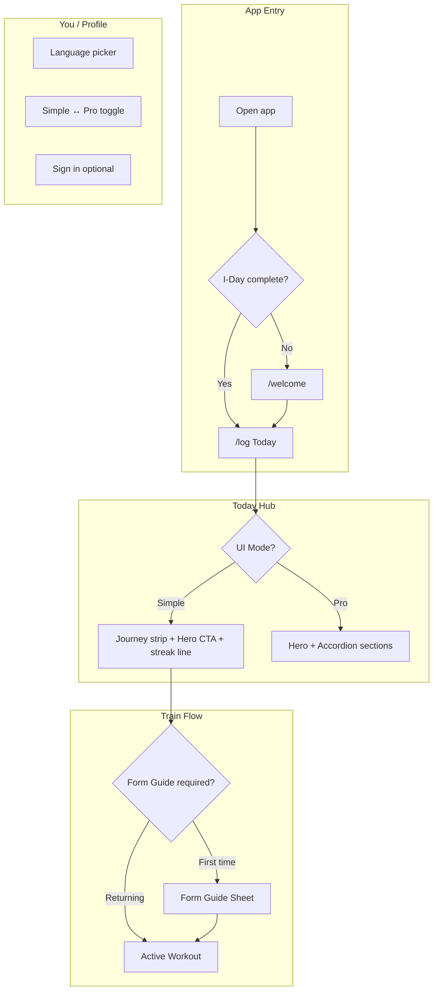

# UX Global Plan — Simple for Everyone, Competitive with Bevel & Freeletics

**Purpose:** Before Phase F2 (navigation surgery), define how Mission Winning becomes a **global, foolproof** health app that can compete on UI clarity — not feature count. This plan incorporates competitive research, a **Simple / Pro** interface model (inspired by crypto “Lite / Pro” apps), multilingual expansion, and a **Form Guide** system for proper movement teaching.

**Status:** Planning document — implementation starts after review.  
**Related:** [JOURNEY.md](JOURNEY.md) · [vision.md](vision.md) · [PLAN.md](PLAN.md) · [PROTECTION.md](PROTECTION.md)

**Disclaimer:** Mission Winning is a **civilian** health PWA. We borrow **structure and discipline** from military-style training (clear commands, named stances, progressive standards) — not DoD branding, rank, or endorsement.

---

## 1. Executive summary

### The problem today

Mission Winning has strong **free-core depth** (200+ exercises, six pillars, journey engine) but the UI still feels like a **builder’s app**, not a **world app**:

| Issue | Impact |
|-------|--------|
| ~95% of UI is hardcoded English | Excludes Korea, Italy, Germany, and most of the world on day one |
| Desktop sidebar has 14+ links | Cognitive overload; contradicts mobile’s clean 5-tab nav |
| Today hub unlocks into many competing cards | Even commissioned users see duplicate CTAs and demo buttons |
| Exercise education = one italic text line | Cannot compete with Freeletics animations or Bevel’s polished fitness tab |
| No user-controlled **Simple vs Advanced** chrome | Simplification is tied only to journey phase, not user preference |

### The target experience

> **“Open the app → see one thing to do → do it → see you won.”**  
> Everything else is optional, hidden, or unlocked later.

Three layers work together:

```
┌─────────────────────────────────────────────────────────────────┐
│  LAYER 1 — JOURNEY (when)     I-Day → Basic → Readiness → Ops   │
│  LAYER 2 — UI MODE (how much) Simple Mode ↔ Pro Mode (toggle)   │
│  LAYER 3 — PREMIUM (depth)    Free core ↔ Super Bundle content  │
└─────────────────────────────────────────────────────────────────┘
```

**Layer 2 is new** and is the crypto-app insight: same app, same account, two interfaces — not two apps, not a paywall.

### North-star competitors

| App | What they do well | What we take | What we do differently |
|-----|-------------------|--------------|------------------------|
| **Bevel** | Metric-first dashboard, customizable home, proactive AI coach, biological age, health records vault, 10+ languages | Dark premium UI, score rings, one-number summaries, reorderable metrics | Strength + global free core; no wearable required to start |
| **Freeletics** | Monochrome design system, Training Journeys, God Workouts as “special moments,” Super Bundle holism, visual refresh (2025) | One hero workout CTA, streak culture, bundle positioning | One unified PWA (not 6 separate apps); bodyweight-first globally |
| **Freeletics Super Bundle** | Train + Calm + Pliability + Skill Yoga + MapMyFitness + Waking Up | Pillar synergy, “7 tools, 1 price” | All pillars in one install; free tier usable in every pillar |
| **Binance Lite / Pro** | One-tap mode switch; Lite = balance + buy/sell; Pro = charts + bots | **Simple Mode / Pro Mode toggle** in Profile | Modes are UX density, not subscription |
| **Gentler Streak** | Localized into FR, DE, IT, KO, JA, ZH with context-aware fitness copy | Professional translation workflow for fitness tone | Broader pillar scope + ISSA education depth |

---

## 2. Competitive deep dive

### 2.1 Bevel — “The Connected Health Coach”

**Positioning:** Everything-health hub — wearables, bloodwork, nutrition, strain/recovery/sleep, strength builder, AI coach.

**UI patterns worth copying:**

1. **Customizable dashboard** — Users pin what matters; irrelevant tiles stay hidden.
2. **One number per domain** — Strain, Recovery, Sleep, Nutrition Score — scannable in 2 seconds.
3. **Proactive coach** — Surfaces the next action without the user asking (maps to our `getNextAction()`).
4. **Liquid-glass / premium dark** — Already aligned with our Bevel-inspired vision layer.
5. **Language expansion** — Bevel 2.3 added Chinese (Simplified + Traditional), Japanese, Dutch; targets global markets deliberately.

**Where Bevel is weak for our mission:**

- Assumes Apple Watch / HealthKit ecosystem (excludes much of the global south).
- Advanced features increasingly gated behind Pro subscription.
- Strength content is secondary to recovery/strain narrative.

**Our response:** Bevel-level **presentation** on a Freeletics-level **free generosity**, with **zero hardware required** to start.

---

### 2.2 Freeletics — Super Bundle + Visual Refresh

**Positioning:** AI Coach training + bundle of partner apps (Calm, Pliability, Skill Yoga, MapMyFitness, Waking Up).

**UI patterns worth copying (2025 Visual Refresh):**

1. **Monochrome product palette** — Content and layout lead; brand color only for “special moments.”
2. **Light default, dark for hero moments** — Training Journeys and God Workouts feel distinct.
3. **Typography that localizes** — Typefaces chosen for multi-script scaling (critical for KO, RU, AR).
4. **Faster-to-scan screens** — Reduced visual debt; consistent spacing system.
5. **Training Journey as progressive path** — Maps directly to our Mission Journey (I-Day → Commissioned).

**Super Bundle lesson:** Users buy **holistic identity** (“I take care of my whole self”), not a feature list. Our `/bundle` page should feel like joining a path, not a pricing table.

---

### 2.3 Crypto Lite / Pro — The Simple ↔ Advanced model

**Pattern (Binance, Coinbase, etc.):**

| | Simple (Lite) | Pro |
|---|---------------|-----|
| **Audience** | First-time users, low tech confidence | Power users, coaches, data lovers |
| **Home** | Portfolio total + 2–3 big buttons | Charts, order books, dense widgets |
| **Navigation** | 4–5 bottom tabs max | Full menu + shortcuts |
| **Switch** | Profile → “Switch to Pro” (instant, same data) | Same |
| **Default** | Lite for new accounts | User choice persists |

**Applied to Mission Winning:**

| | **Simple Mode** (default) | **Pro Mode** |
|---|---------------------------|--------------|
| **Today** | Journey strip + one hero CTA + optional streak line | Full metrics row, challenges, readiness grid, history |
| **Nav** | 5 tabs: Today · Train · Fuel · Track · You | 5 tabs + **More** sheet (Move, Mind, Learn, Builder, Library, History, Bundle) |
| **Train** | Start / resume workout only | Active + Builder + Library + Programs |
| **Exercise detail** | Loop video + 3 bullet cues + “Start set” | Full form guide, alternatives, tags, history |
| **Typography** | Larger (18px+ body), fewer words | Standard density |
| **Language** | Plain glossary terms only | Full terminology (RPE, periodization, etc.) |

**Critical rule:** Simple Mode is **free** and **not** a downgrade — it is the **recommended** interface for 80%+ of users worldwide.

**Storage:** `localStorage mw_ui_mode = 'simple' | 'pro'` (+ Supabase `profiles.ui_mode` in F3).

---

## 3. Design principles — “Keep it simple, stupid” (KISS)

Interpreted as **foolproof**, globally inclusive, zero jargon by default.

### 3.1 The five laws

| Law | Rule | Test |
|-----|------|------|
| **One boss screen** | `/log` (Today) answers *“What do I do right now?”* | User never lands on a wall of choices |
| **One green button** | Exactly one primary CTA per screen | Screenshot test: can a stranger find it in 1 second? |
| **Five taps max** | Any daily habit completable in ≤5 taps from Today | Timed user test on 3G Android |
| **Plain words** | “Start workout” not “Initialize session” | No English idioms in UI copy |
| **Progress always visible** | Journey strip or day counter until commissioned | Never hide “where am I?” |

### 3.2 Global design constraints

| Constraint | Implementation |
|------------|----------------|
| **Text expansion** | German +35%, Finnish +40%; use `min-width` buttons, flexible grids, no fixed label widths |
| **Compact scripts** | Japanese/Korean −10–20%; avoid empty fixed-width boxes |
| **RTL (future)** | Arabic/Hebrew: logical CSS (`inline-start`), mirrored nav arrows — plan now, ship in G2 |
| **Units** | Metric default; imperial toggle in Profile; locale-aware number formatting |
| **Low bandwidth** | Text-first Simple Mode; lazy-load video posters; offline PWA for core train/fuel |
| **Low literacy / low tech** | Icons + numbers over paragraphs; voice-over ready structure (future) |
| **Thumb zone** | Primary actions bottom-center on mobile; min 48px touch targets |

### 3.3 Visual system (Freeletics-inspired refresh)

```
COLORS
  Background:     #0a0f1a (dark) / #fafafa (light — future)
  Surface:        #111827 cards
  Primary action: emerald-600 (one green — never two greens fighting)
  Text:           white / white-70 / white-40 hierarchy
  Accent moments: gradient only on Journey hero + commissioning

TYPOGRAPHY
  Headline:  Inter/system, bold, tracking-tight
  Body Simple Mode: 18px / 1.5 line-height
  Body Pro Mode: 14px / 1.4
  Scripts:   Noto Sans family (Latin, Cyrillic, CJK, Arabic fallback)

SPACING
  4px grid; Simple Mode doubles vertical rhythm (more air)
```

**Special moments (dark theme cards):** I-Day, commissioning, first workout complete, PR badge — mirroring Freeletics “God Workout” treatment.

---

## 4. Form Guide system — “Warrior Stance” model

### 4.1 Why text cues are not enough

Today: `{exercise.cues}` is one italic string in Active Workout and Library.  
Competitors: loop MP4 (300 KB), multi-angle, muscle highlight, step-by-step.

To compete globally — including users with **low literacy** — form teaching must be **visual-first, text-second**.

### 4.2 The “Warrior Stance” pattern

Named after structured martial arts / military movement instruction: every technique has a **named ready position**, clear **commands**, and **standards** before execution.

**Example — Rifle Ready / Athletic Stance (civilian adaptation):**

```
┌──────────────────────────────────────────┐
│  [ LOOP VIDEO or POSTER — side angle ]     │
│                                          │
│  WARRIOR STANCE                          │
│  Your ready position for this movement   │
│                                          │
│  SETUP                                   │
│  · Feet shoulder-width                   │
│  · Knees soft, weight mid-foot           │
│  · Core braced, eyes forward             │
│                                          │
│  EXECUTE                                 │
│  · Hinge hips → descend                  │
│  · Knees track toes                      │
│  · Drive through floor to stand          │
│                                          │
│  COMMON ERRORS                           │
│  ✗ Knees cave inward                     │
│  ✗ Heels lift                            │
│                                          │
│  BREATH                                  │
│  In down · Out up                        │
│                                          │
│  [ ✓ Got it — start set ]                │
└──────────────────────────────────────────┘
```

**Tone:** Clear, commanding, respectful — like a good coach, not a drill sergeant.  
**Legal:** No DoD logos, ranks, or implied endorsement. “Warrior Stance” is a **generic athletic ready position** name.

### 4.3 Form Guide data model (proposed)

Extend `Exercise` in `src/types/index.ts`:

```typescript
interface FormGuide {
  readyPosition?: string;      // e.g. "Warrior Stance", "Hollow Body", "Tabletop"
  setup: string[];               // 2–4 bullet steps
  execute: string[];             // 2–5 bullet steps
  commonErrors?: string[];       // 2–3 "don't" items
  breathing?: string;            // e.g. "In down, out up"
  safetyNote?: string;           // PAR-Q-linked warnings if any
  media?: {
    posterUrl?: string;          // WebP thumbnail (CDN)
    loopMp4Url?: string;         // 480p loop, muted
    angles?: ('front' | 'side' | 'diagonal')[];
  };
}

interface Exercise {
  // ... existing fields
  cues?: string;                 // keep for backward compat (summary line)
  formGuide?: FormGuide;         // full structured guide
}
```

### 4.4 Where Form Guides appear

| Context | Simple Mode | Pro Mode |
|---------|-------------|----------|
| **Library** | Poster + ready position name | Full guide card + alternatives |
| **Active workout** | “Form check” tap → bottom sheet with loop video | Inline expandable guide |
| **First workout (BT-1)** | Required 15-second form view before first set | Optional skip |
| **Move flows** | Named positions per step (yoga/mobility) | Same + timer cues |

### 4.5 Media sourcing strategy

| Phase | Approach | Cost / effort |
|-------|----------|---------------|
| **G2a (MVP)** | Poster images (static) + structured text for **50 priority exercises** (squat, push-up, plank, hinge, lunge, etc.) | Low — can use licensed stock or commissioned silhouettes |
| **G2b** | License loop MP4 library (MoveKit, GymVisual, or similar) — CDN hosted, lazy loaded | ~$1–2/exercise commercial license |
| **G3** | Custom branded 3D or filmed content for signature “Mission” movements | Higher — post-revenue |

**Technical:** MP4 H.264, muted, `playsInline`, poster WebP, `IntersectionObserver` lazy load — ~300 KB per clip at 480p.

### 4.6 ISSA alignment

Form Guide content should follow ISSA cueing standards already in our enrichment pipeline:

- **ISSA Check — Start — Move — Finish** structure maps to Setup → Execute → Common Errors.
- Learn pillar links “Why this form matters” lessons to each guide (Pro Mode).

---

## 5. Internationalization (i18n) strategy

### 5.1 Current state

- **Built:** `i18next` + `react-i18next`, 5 languages (EN, ES, FR, PT, RU), ~100 keys in inline `src/i18n.ts`
- **Gap:** 95%+ of UI untranslated; no locale files; static `<html lang="en">`; journey/welcome English-only

### 5.2 Target languages (priority order)

| Tier | Languages | Rationale |
|------|-----------|-----------|
| **Tier 1 (launch global)** | EN, ES, PT, FR, **DE**, **IT**, **RU**, **KO** | Covers Americas, Europe, Russia, Korea — matches vision.md + user request |
| **Tier 2 (3 months post-launch)** | ZH (Simplified), JA, AR, HI, TR | Asia-Pacific + Middle East + India |
| **Tier 3 (expansion)** | NL, PL, UK-UA, VI, ID, TH | Bevel/Gentler Streak parity |

**User-requested:** Korean, Russian, Italian, German — all in **Tier 1**.

### 5.3 Architecture migration

```
src/locales/
  en/
    common.json      # Nav, buttons, errors
    journey.json     # I-Day, phases, commissioning
    train.json       # Workout, form guides UI chrome
    fuel.json
    pillars.json     # Move, Mind, Learn, Track
    exercises/       # Optional: top 50 movement names + cues
  de/
  it/
  ko/
  ru/
  ...
```

**Implementation steps (Phase G1):**

1. Extract inline `i18n.ts` → JSON namespaces per domain.
2. Wire `app/layout.tsx` to set `<html lang={i18n.language} dir={rtl}>`.
3. Replace hardcoded strings in: WelcomePage, JourneyHero, HomePage, MobileNav, Sidebar, ActiveWorkout, Nutrition, Profile.
4. Add `lang_de`, `lang_it`, `lang_ko` to language switcher (Profile + first-run on I-Day step 0.1).
5. **Pseudo-localization** dev flag (`en-XA`) to stress-test overflow.
6. **Locale-aware formatting** via `Intl.DateTimeFormat`, `Intl.NumberFormat`.

### 5.4 Exercise content translation

200+ exercises × 5 strings each = large corpus. Phased approach:

| Phase | Scope |
|-------|-------|
| G1 | UI chrome only (buttons, nav, journey) |
| G2 | Top 50 exercise **names** + **ready position** labels |
| G3 | Full form guide setup/execute/errors in Tier 1 languages |
| G4 | Professional review by native-speaking fitness translators (Gentler Streak model) |

**Do not machine-translate safety-critical form cues without human review.**

### 5.5 Copy glossary (global plain language)

| Avoid (English idiom) | Use (Simple Mode) | DE example | KO example |
|-----------------------|-------------------|------------|------------|
| Dashboard | **Today** | Heute | 오늘 |
| Initialize session | **Start workout** | Training starten | 운동 시작 |
| Macro logging | **Log food** | Essen eintragen | 식사 기록 |
| Onboarding | **First steps** | Erste Schritte | 첫 걸음 |
| Pillar win | **Done ✓** | Erledigt ✓ | 완료 ✓ |
| Mission Setup | **Your profile** | Dein Profil | 내 프로필 |

Full glossary lives in `JOURNEY.md` — extend per language in locale files.

---

## 6. Information architecture (revised)

### 6.1 Simple Mode navigation

```
Mobile (always):
┌────────┬────────┬────────┬────────┬────────┐
│ Today  │ Train  │ Fuel   │ Track  │  You   │
│  /log  │/active │/nutrition│/track │/profile│
└────────┴────────┴────────┴────────┴────────┘

Desktop: Same 5 items in slim sidebar — NO 14-link pillar tree in Simple Mode.
```

**Train tab behavior (Simple):** Opens active workout if in progress; else starts journey-recommended workout or “First Mission Workout.”

**You tab:** Profile, language, Simple/Pro toggle, sign-in, journey progress, optional sign-out.

### 6.2 Pro Mode navigation

```
Mobile: Same 5 tabs + "More" button (sheet):
  Move · Mind · Learn · Builder · Library · History · Bundle · Assessments

Desktop: 5 primary + collapsible More section (not 14 flat links).
```

### 6.3 Today hub — Simple vs Pro

**Simple Mode Today (always):**

```
┌─────────────────────────────────────┐
│  Mission Winning · Today            │
│  Mon Jun 29 — Legs focus            │
│  ━━━━━━━━━━━━━━━━━━━ 40%           │  ← Journey strip
│                                     │
│  ┌─────────────────────────────┐   │
│  │  YOUR NEXT STEP              │   │
│  │  Start your first workout    │   │
│  │  [ Start workout        → ]  │   │  ← ONE green button
│  └─────────────────────────────┘   │
│                                     │
│  🔥 3-day streak                    │  ← One line max
└─────────────────────────────────────┘
```

**Pro Mode Today:** Adds collapsible sections (accordion):

- **Details** — Metrics, muscle readiness, cross-pillar score
- **This week** — Challenges, streak breakdown
- **Quick options** — Starters, saved routines
- **History** — Recent wins

Default: **Details collapsed** — user expands if they want data (Bevel-style).

---

## 7. Revised implementation roadmap

Phase F and new Phase G reorganized to reflect this plan. **F2 waits for approval of this document.**

### Phase F (Journey + chrome) — updated

| Sub-phase | Deliverable | Depends on |
|-----------|-------------|------------|
| **F1** ✅ | Journey engine, I-Day, Today hero | — |
| **F2a** | **Simple / Pro Mode** toggle + `mw_ui_mode` persistence | This plan §4 |
| **F2b** | Sidebar → 5 tabs + More (Pro only); Simple hides More | F2a |
| **F2c** | Today accordion (Pro); strip demo/debug buttons from HomePage | F2a |
| **F2d** | Commissioning ceremony modal + `mw_commissioned_at` badge | F1 |
| **F2e** | Copy pass — plain language glossary applied to all pages | G1 partial |
| **F3** | Supabase `profiles.ui_mode` + `journey_state` sync | F2a |
| **F4** | Beta funnel metrics → Phase E gate | F2 + PROTECTION P0 |

### Phase G (Global + form guides) — new

| Sub-phase | Deliverable |
|-----------|-------------|
| **G1** | Locale JSON extraction; Tier 1 languages (DE, IT, KO + existing); dynamic `html lang` |
| **G2a** | Form Guide schema + `FormGuideSheet` component |
| **G2b** | 50 priority exercises with structured guides (text + poster) |
| **G2c** | Licensed loop MP4 CDN integration for top 50 |
| **G3** | Exercise name/cue translation Tier 1; human review for safety strings |
| **G4** | RTL Arabic support; Tier 2 languages |

### Suggested branch order

```
cursor/journey-i-day-699d     ✅ F1 (merged or merging)
cursor/simple-pro-mode-699d   → F2a
cursor/nav-more-sheet-699d    → F2b
cursor/today-accordion-699d   → F2c
cursor/i18n-tier1-699d        → G1
cursor/form-guides-699d       → G2a–b
```

---

## 8. Success metrics

### UX competitiveness (beta, n=20+)

| Metric | Target | Competitor benchmark |
|--------|--------|---------------------|
| Time to first action (install → workout start) | < 3 min | Freeletics ~2–4 min |
| “Where do I start?” support tickets | 0 | — |
| I-Day completion | ≥ 80% | — |
| Simple Mode retention (7-day) | ≥ 60% stay in Simple | Binance Lite ~70% stay Lite |
| Form Guide opens per workout | ≥ 1 for BT-1 users | — |
| Language switch usage | ≥ 30% non-EN in beta cohort | Bevel multi-lang ~40% non-EN |

### Global readiness checklist (before Phase E)

- [ ] Tier 1 languages ship for all journey + nav + primary CTAs
- [ ] German UI passes overflow test (longest strings)
- [ ] Korean UI passes overflow test (CJK line height)
- [ ] Simple Mode is default for new users
- [ ] 50 exercises have Form Guides with at least poster + setup/execute
- [ ] No inline sign-in forms outside Profile
- [ ] Desktop nav matches mobile tab count in Simple Mode
- [ ] `npm run build` + pseudo-localization CI check

---

## 9. Wireframes — mode comparison



---

## 10. What we explicitly will NOT do

| Anti-pattern | Why |
|--------------|-----|
| Gate Simple Mode behind paywall | Simple = accessibility, not premium |
| Auto-switch to Pro Mode to upsell | User chooses; suggest after commissioning only |
| 14-link sidebar in Simple Mode | Defeats KISS |
| English-only form safety cues | Liability + exclusion |
| DoD branding or rank imagery | Civilian app; legal/trust risk |
| GIF exercise demos | 10–50× larger than MP4; bad on 3G |
| Machine-translate breath/safety cues without review | Injury risk |

---

## 11. Immediate next steps (after your review)

1. **Approve** this plan (or mark sections to cut/defer).
2. **Start F2a** — Simple/Pro toggle in Profile + conditional chrome (smallest shippable win).
3. **Parallel G1** — extract i18n to JSON; add DE, IT, KO translators (can use professional service or community beta).
4. **Parallel G2a** — Form Guide schema + bottom sheet component; seed 10 exercises manually as proof.
5. **Design pass** — one Figma frame each for Simple Today, Pro Today, Form Guide sheet (optional but recommended).

---

## 12. Open questions for product owner

1. **Simple Mode default forever?** Or auto-prompt “Try Pro Mode” after 14 days commissioned?
2. **Form Guide media budget** — License MoveKit/GymVisual (~$200–500 for 50 clips) vs static posters only for v1?
3. **Tier 1 translation** — Machine + human review vs professional localization vendor (Gentler Streak used Alconost)?
4. **Warrior Stance naming** — Keep military-inspired names (Warrior, Sentinel, Guard) or neutral (Ready, Start, Athlete)?
5. **Light theme** — Simple Mode light default for outdoor/bright environments (Freeletics uses light default)?

---

*Last updated: 2026-06-29 · Author: Cloud Agent · Review before F2 implementation*
