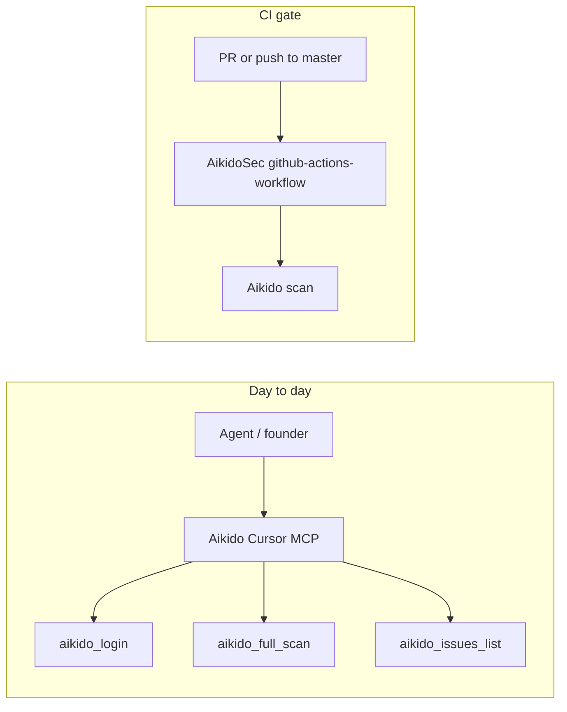

# Aikido Security — Cursor + CI

**Audience:** Founder + agents  
**Complements:** [PROTECTION.md](PROTECTION.md), [OWASP_AUDIT.md](OWASP_AUDIT.md), [SECURITY_AUDIT_TRIAGE.md](SECURITY_AUDIT_TRIAGE.md), soft `npm audit` + CodeQL in CI.

Aikido is **not** a replacement for those tools. Cursor MCP is for day-to-day SAST/secrets triage; GitHub Actions gates **CRITICAL** dependency findings on `master` / PRs when the CI secret is set.

---

## Founder checklist (do once)

- [ ] Create / open [Aikido](https://app.aikido.dev) account
- [ ] Connect GitHub repo **Snedz/missionwinning** in Aikido dashboard
- [ ] Continuous Integration settings → generate token → copy once
- [ ] GitHub → Settings → Secrets and variables → Actions → `AIKIDO_SECRET_KEY` = that token (**GitHub only**, not Vercel)
- [ ] Confirm Actions → **Aikido** workflow runs on next push/PR (or is skipped until secret is set)
- [ ] Sign in to Cursor Aikido MCP (`aikido_login` / region URL) when an agent asks
- [ ] **IDE MCP permissions** — [Settings → Integrations → IDE / MCP](https://app.us.aikido.dev/settings/integrations/ide/mcp/permissions) → enable **issues list** (required for `aikido_issues_list`)

Agents **never** mark the token/account boxes done.

---

## Cursor MCP (day-to-day)

Server: `plugin-aikido-cursor-plugin-aikido`

| Tool | Use |
|------|-----|
| `aikido_login` | Sign-in / re-auth (region URLs EU/US/ME) |
| `aikido_full_scan` | SAST + secrets on ≤50 files per call (relative paths + content) |
| `aikido_issues_list` | Feed for repo / branch / issue types |
| `aikido_ignore_issue` | Ignore only with founder-agreed reason |

### Hot-path scan recipe (≤50 files / batch)

Prefer security-sensitive surfaces:

1. `app/api/**/route.ts` — especially private-access, webhooks, premium, checkout, crypto
2. `src/lib/premiumServer.ts`, `premiumEnrollmentCache.ts`, `rateLimit.ts`, `privateGate*.ts`
3. `src/lib/cryptoCheckout/**`, `stripeWebhook.ts`, `paypalWebhook.ts`

Pass `repository_name: missionwinning` (or `Snedz/missionwinning` if the platform expects the full slug) only when files are from this git repo.

### Triage rules

| Finding | Action |
|---------|--------|
| **CRITICAL leaked secret** | Fix immediately — rotate; **do not** ignore |
| Phantom / Solana dependency CVEs | Map to [SECURITY_AUDIT_TRIAGE.md](SECURITY_AUDIT_TRIAGE.md) accepted risk until crypto path removed |
| SAST medium/low on free core | Fix if cheap; else track in PROTECTION backlog |
| Ignore | Only via `aikido_ignore_issue` after founder agrees + written reason |

---

## CI gate (`.github/workflows/aikido.yml`)

| Setting | v1 value |
|---------|----------|
| Triggers | `pull_request` + `push` to `master` |
| Secret | `AIKIDO_SECRET_KEY` — job **skipped** when unset |
| Fail on dependency | `true`, `minimum-severity: CRITICAL` |
| Fail on SAST / IaC | `false` (noise + free-tier; revisit after first clean scan) |

Does **not** replace CodeQL or `npm audit --audit-level=high` (soft) in [`.github/workflows/ci.yml`](../.github/workflows/ci.yml).

### Verify

1. Without secret: Aikido job shows **Skipped**.
2. With secret: job runs; CRITICAL new dependency issues fail the check.
3. Cursor: `aikido_issues_list` with `repo_name: missionwinning`.

---

## Related Aikido docs (vendor)

- CI settings: https://app.aikido.dev/settings/integrations/continuous-integration  
- GitHub Action: https://github.com/marketplace/actions/aikido-security-github-action  

---

## First triage pass (agent log)

| Date | Auth | Scan | Open CRITICAL secrets | Phantom/Solana mapped |
|------|------|------|----------------------|------------------------|
| 2026-07-20 | **OK** — Cursor MCP signed in (US region) | `aikido_full_scan` batch 1–2 on hot paths (`private-access`, webhooks, `premiumServer`, `cryptoCheckout/*`, `privateSession`, `rateLimit`) — **0 SAST/secrets findings** | None in scan | `aikido_issues_list` **disabled** — enable [IDE MCP permissions](https://app.us.aikido.dev/settings/integrations/ide/mcp/permissions); dependency SCA via CI once `AIKIDO_SECRET_KEY` is set |

**Next:** Enable MCP issues feed → retry `aikido_issues_list` (`repo_name: missionwinning`). Set GitHub `AIKIDO_SECRET_KEY` for dependency gate on PRs.