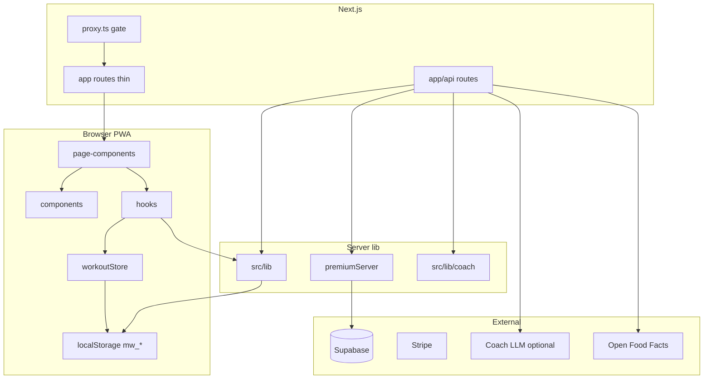
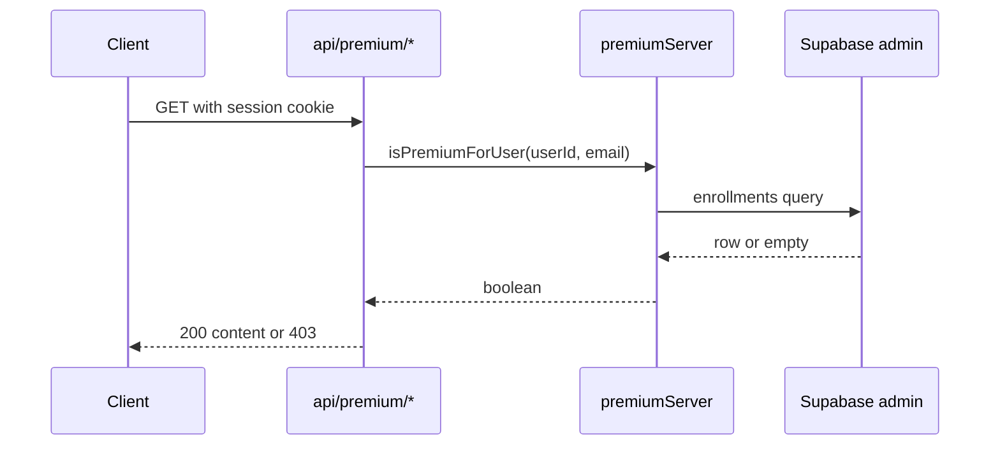

# Architecture — Mission Winning

System design for developers and agents. User-facing explanations live in [help/](help/INDEX.md).

---

## Layer diagram

---

## Request lifecycle (page)

1. **Edge:** [`proxy.ts`](../proxy.ts) — if `PRIVATE_MODE=true`, require gate cookie or Supabase session (except public SEO paths).
2. **Route:** `app/(app)/foo/page.tsx` — metadata + import `FooPage`.
3. **Layout:** `AppLayout` — nav, auth chip, journey guard.
4. **Page:** `src/page-components/FooPage.tsx` — composes components.
5. **Hooks:** `src/hooks/*` — orchestrate lib + store + fetch to API.
6. **Lib:** `src/lib/*` — pure logic, localStorage, scoring.
7. **API (when needed):** `fetch('/api/...')` — premium content, LLM, fuel proxies, school cloud.

---

## Request lifecycle (API)

1. `proxy.ts` gate (if private mode).
2. Route handler in `app/api/**/route.ts` — thin: rate limit → auth → Zod → delegate to `src/lib/`.
3. Response JSON; errors 400/401/403/429/503 as appropriate.

See [API.md](API.md) for per-route auth and limits.

---

## State management

### Zustand — active workout

[`src/store/workoutStore.ts`](../src/store/workoutStore.ts) holds the **in-progress workout** (exercises, sets, timer). Persisted to session; merged into history on finish via lib helpers.

### localStorage — `mw_*` keys

Primary device database for:

| Domain | Examples |
|--------|----------|
| History | Workout sessions |
| Coach | Plan JSON, taster flags, equipment |
| Journey | I-Day progress, commissioning |
| Prefs | Units, dashboard layout, UI mode |
| School | Joined class code, teacher classes (local cache) |
| Nutrition | Daily log entries |

Cloud sync (Supabase) overlays select domains when user is signed in — see `journeySync.ts`, `coachSync.ts`, `pftSync.ts`.

### Supabase

- **Anon key + RLS** — client reads/writes user-scoped rows with JWT.
- **Service role** — server-only: webhooks, premium enrollment, leads insert, admin school ops.

---

## Premium gating

- **Never** trust `localStorage` for premium in production.
- `DEMO_PREMIUM=true` only works in development builds.
- Content bundles are `server-only` imports split from client chunks.

---

## Mission Coach pipeline

Client-side weekly engine — full pipeline in [src/lib/coach/INDEX.md](../src/lib/coach/INDEX.md):

`contextBuilder` → `planEngine` → `adapt` → `storage`

Optional server voice: `POST /api/coach/plan-voice` → `planVoiceServer.ts`.

Daily insight: `POST /api/coach/daily-insight` → `coachDailyServer.ts` (rules or LLM).

---

## i18n

- **Runtime strings:** `src/i18n/*Locales.ts` — imported by `i18next`.
- **Deprecated:** `src/locales/` — do not add keys there.
- **Public SEO locales:** `public/locales/` for HTTP override loader.
- **Export:** `src/lib/exportLocales.ts` — 22 namespaces × langs.

---

## PWA / offline

- `next-pwa` in `next.config.js`.
- Service worker caching **disabled** while `PRIVATE_MODE` is active (avoid caching gated shell).
- `/offline` fallback page for navigation failures.

---

## Security perimeter

| Layer | Module |
|-------|--------|
| Gate | `proxy.ts`, `privateGate.ts`, `privateSession.ts` |
| API auth | `supabaseRequestAuth.ts`, `requestAccess.ts` |
| Rate limits | `rateLimit.ts` (Upstash or in-memory) |
| Validation | `apiSchemas.ts` (Zod) |
| School access | `schoolClassAccess.ts` |
| Webhooks | `stripeWebhook.ts`, `paypalWebhook.ts` |

Details: [PROTECTION.md](PROTECTION.md), [OWASP_AUDIT.md](OWASP_AUDIT.md).

---

## Static data

[`src/data/`](../src/data/INDEX.md) — exercises, recipes, guidebook chapters, programs. Imported at build time; JSON-LD for SEO from catalogs only.

---

## Testing

- Unit: `src/lib/**/*.test.ts` — `npm test`
- E2E: Playwright — `npm run e2e`
- Deploy smoke: `npm run gate-smoke` / `npm run security-smoke`

---

## Mission OS minis

Reserved utility manifests (`utility.clearshot` at `mission://minis/clearshot`) and a capability bus live in [`packages/mw-core/src/module/`](../packages/mw-core/src/module/). Health stub (`l1.health` at `mission://minis/health` — L1 first mini, not `utility.*`; identity + storage only) mounts via [`src/lib/mission-os/health.ts`](../src/lib/mission-os/health.ts). Last-segment deeplink table (`health` / `clearshot`) lives in [`src/lib/mission-os/deeplink.ts`](../src/lib/mission-os/deeplink.ts) — `mission://minis/clearshot` mounts `utility.clearshot`; an unknown last-segment is `unknown_mini` (does not throw, does not mount); a malformed / non-`mission://minis/<segment>` URI is `bad_deeplink` (does not throw, does not mount). Function web stubs are [`src/lib/minis/`](../src/lib/minis/) (#935). Named doors (`MiniHost.mount`, `MiniHost.unmount`, `MiniHost.listMounted`, `CapResult`) and in-memory fakes are [`src/lib/mission-os/`](../src/lib/mission-os/). Billing fake methods (`read` / `checkout` / `portal`) share one `CapResult` deny when unscoped. Photos fake methods (`read` / `write`) share one `CapResult` deny when unscoped (`l1.health`); scoped ClearShot stays `photos_stub`. Identity fake method (`read`) shares one `CapResult` deny when unscoped (test-only `test.noidentity`); Health + ClearShot keep stub success. `listMounted` returns mounted ids + declared scopes only (undeclared peek `scope_denied`; never-mounted `unknown_mini`). Storage fake methods (`get` / `set`) share one `CapResult` deny when unscoped (`test.nostorage`); Health keeps stub success; ClearShot `set` succeeds, `get` stays `scope_denied`. A name outside the closed set on a declared door is `unknown_method` (`callDoor`); on an undeclared door the same name stays `scope_denied`. A second mount of a still-mounted id is `already_mounted`. An id outside the closed host allowlist is `unknown_mini` on `MiniHost.mount` (no partial mount). `MiniHost.unmount` of an id that is not currently mounted is `not_mounted`. A capability call (`MiniHost.call` / `callMountedDoor`) for an id that is not currently mounted is `not_mounted` (does not throw, does not auto-mount). Host chrome and ClearShot / Health product UI are later — no Today / Train / More door. Android `:minis:clearshot` is deferred ([apps/android/INDEX.md](../apps/android/INDEX.md)). Isolation: [`src/lib/minisIsolation.test.ts`](../src/lib/minisIsolation.test.ts) (coach / logger / Today stay blind) and [`src/lib/mission-os/mountIsolation.test.ts`](../src/lib/mission-os/mountIsolation.test.ts) (Health + ClearShot keyspace on bus fakes).

---

## Related

- [API.md](API.md) — HTTP reference
- [CONTRIBUTING.md](../CONTRIBUTING.md) — how to add code
- [app/INDEX.md](../app/INDEX.md) — route map
