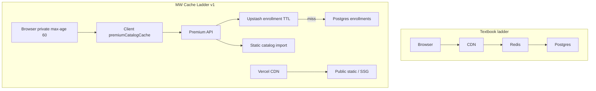

# Cache ladder — ideal vs Mission Winning

**Layer:** Production stack L10 (Caching / CDN)  
**Companion:** [PRODUCTION_STACK.md](PRODUCTION_STACK.md) · [src/lib/premiumEnrollmentCache.ts](../src/lib/premiumEnrollmentCache.ts)

## Short answer

We do **not** pretend every request walks:

`Browser (0ms) → CDN (20ms) → Redis (50ms) → Postgres (200ms)`

Authenticated premium APIs must stay **private** (no shared CDN). Redis is used for **rate limits** and **enrollment memoization** — not for full catalog JSON. Catalog **bodies** are static `@/data` imports; Postgres is hit mainly for **enrollment checks**.

## Layer map

| Ideal | MW v1 | Notes |
|-------|-------|-------|
| Browser ~0ms | `Cache-Control: private, max-age=60, stale-while-revalidate=300` on `/api/premium/*` catalogs + client Map in `premiumCatalogCache.ts` | Never `public` on paid APIs |
| CDN ~20ms | Vercel `_next/static` (hashed), SSG marketing pages, long-cache `/form-guides/*` | Gate HTML may be `no-store` while private |
| Redis ~50ms | Upstash: rate limits **and** `premium:user:{id}` / `premium:email:{email}` enrollment TTL (~90s) | No Redis body cache for recipes |
| Postgres ~200ms | `enrollments` on enrollment cache **miss** only (when Upstash set) | Without Upstash: every request queries Postgres (same as before) |

## Why not a naive public CDN for APIs

1. Shared edge cache would leak Super Bundle content.
2. Caching full recipe JSON in Redis buys little — payloads are already in-process imports.
3. The expensive repeat cost is **`isPremiumForUser` → Postgres**.

## Definition of Done (L10 v1)

- [x] This doc linked from PRODUCTION_STACK + docs INDEX
- [x] Enrollment Redis memo with webhook invalidation; no-op without Upstash
- [x] Premium APIs remain `private` (never `public` / `s-maxage`)
- [x] Public static `/form-guides/*` has long-cache headers
- [ ] Serwist SW live after `PRIVATE_MODE=false` (Wave B — founder flip)

## Explicitly deferred

- Full media CDN / ISR for all app routes  
- Redis-caching catalog JSON  
- Shared CDN for `/api/premium/*`  
- Turning on Serwist while private gate is on  

## Related code

| Path | Role |
|------|------|
| `src/lib/premiumEnrollmentCache.ts` | Upstash enrollment GET/SET/DEL |
| `src/lib/premiumServer.ts` | `isPremiumForUser` + grant + invalidate |
| `src/lib/premiumCatalogCache.ts` | Browser-side fetch dedup |
| `src/lib/rateLimit.ts` | Upstash rate-limit counters |
| `app/api/premium/*/route.ts` | `private` Cache-Control |
| `next.config.js` | Serwist gate + static asset headers |
