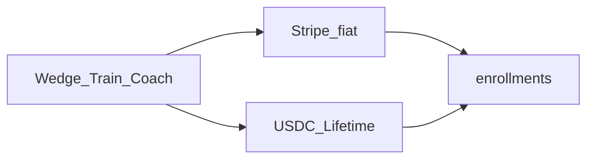

# Crypto rails thesis — Mission Winning

**Audience:** Founder + agents (positioning / horizon gates)  
**Wedge (unchanged):** [YC_THESIS.md](YC_THESIS.md) — Train + Mission Coach  
**Ops:** [PHANTOM_USDC_CHECKOUT.md](PHANTOM_USDC_CHECKOUT.md) · [STRIPE_PREMIUM_SETUP.md](STRIPE_PREMIUM_SETUP.md) · [LAUNCH_RUNBOOK.md](LAUNCH_RUNBOOK.md) §4  
**Rule:** We **use** crypto rails. We are **not** a crypto app.

---

## Source thesis (paraphrase)

YC / Nemil (“The Best Time to Build in Crypto”): prices and hype can be down while underlying tech gets more useful — stablecoins into institutions, fintech on crypto rails, tokenized trading, and (later) AI agents transacting on networks. Bear markets favor real builders over yield tourists. Most startups will eventually touch crypto rails for capital or payments; many end users will never know.

## Mission Winning reading

Mission Winning is adaptive coaching for train-anywhere athletes. Super Bundle is the one paid SKU. Crypto enters only as a **payment rail** for Lifetime USDC (Phantom today; Stripe Stablecoins when live KYB allows) — same `enrollments` path as Stripe fiat.

| Essay claim | MW reading |
|-------------|------------|
| Bear market = build real utility | Ship coach retention; crypto is quiet infrastructure, not the narrative |
| Stablecoins in fintech | Lifetime Phantom USDC + (later) Stripe Crypto = same Bundle, fiat mindset |
| Invisible rails | Stripe card/Link first; Phantom for crypto-native buyers; logger/Coach unchanged |
| Agents on crypto networks | Post-PMF research only — not Horizon 0 |
| Capital raising / tokenized assets / L2s | Out of scope — not the wedge |
| Attract builders, not yield tourists | Free core forever; honest paid signal; no “crypto earn” gimmicks |

---

## Now / next / never

| Horizon | Crypto work |
|---------|-------------|
| **0 (now)** | Verify rails only: fund treasury USDC ATA; one signed-in Lifetime Phantom pay → `enrollments.provider = phantom`. No marketing of crypto. No new chains/SKUs. |
| **1 (public + revenue)** | Keep Phantom as optional Lifetime path. If live Stripe KYB ready: enable Dashboard **Stablecoins and Crypto** on Lifetime Sessions only. |
| **2+ (post-PMF)** | Research only: agent/coach commerce on rails if retention holds. Never the company one-liner. |
| **Never (as pitch)** | “Crypto coach,” on-chain fitness NFTs, token launches, monthly Phantom, EVM sprawl, Kraken deposit matching as product. |

---

## Explicit non-goals

- Repositioning MW as a crypto company for YC or the landing hero
- New coins, L2s, monthly/annual Phantom, automated on-chain refunds
- Public crypto marketing before one end-to-end Lifetime USDC payment is verified on prod
- Letting crypto work displace beta distribution (Horizon 0 #1 bottleneck)

---

## Related

- Product wedge: [YC_THESIS.md](YC_THESIS.md)  
- Phantom Lifetime setup: [PHANTOM_USDC_CHECKOUT.md](PHANTOM_USDC_CHECKOUT.md)  
- Stripe + Stablecoins: [STRIPE_PREMIUM_SETUP.md](STRIPE_PREMIUM_SETUP.md)  
- Founder checklist: [LAUNCH_RUNBOOK.md](LAUNCH_RUNBOOK.md) §4  
- Gates: [ORCHESTRATION.md](../ORCHESTRATION.md) · status: [CONTEXT.md](../CONTEXT.md)
