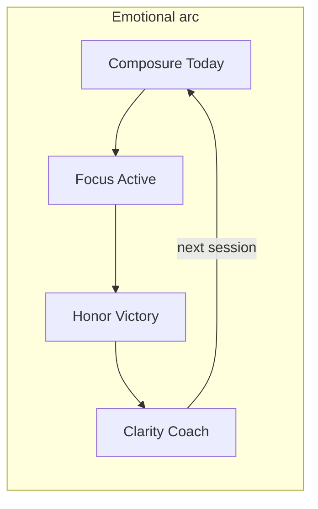

# Design Orchestration — Mission Winning

**Audience:** Design / Brand lane (agents + founder approve)  
**Product gates:** [ORCHESTRATION.md](../ORCHESTRATION.md) · **Status:** [CONTEXT.md](../CONTEXT.md) `## Now`  
**Companions:** [brand-guidelines.md](brand-guidelines.md) · [DESIGN_SYSTEM.md](DESIGN_SYSTEM.md) · [ADAPTIVE_LAYOUT.md](ADAPTIVE_LAYOUT.md) · [DESIGN_RESEARCH.md](DESIGN_RESEARCH.md) · [DESIGN_REVIEW.md](DESIGN_REVIEW.md) · [apps/android/UX.md](../apps/android/UX.md)

Use this file to decide **what design craft ships next** and **what is vanity until retention unlocks**. Do not replace the brand — refine execution.

> **Founder override 2026-07-25 — Modernist rebrand.** The no-brand-replacement rule is superseded by the founder-commissioned Modernist rebrand (design handoff: ink-on-paper `#f3f2f2`/`#201e1d`, one red accent `#ec3013`, Archivo only, radius 0, 2px rules, light-only; plan approved 2026-07-25). Wave D5 below tracks it, and it **shipped** — `.131` rewrote [DESIGN_SYSTEM.md](DESIGN_SYSTEM.md) and [brand-guidelines.md](brand-guidelines.md), which are the source of truth for tokens and type. The lock table below now describes the **shipped** system; it described the outgoing one until `.240`, ten builds after the condition for updating it was met. **Android:** cross-platform token sync is paused for the program (founder decision 2026-07-25) — Android keeps navy/emerald and gets its own rebrand program after web.

---

## Where we are

Product status lives in [CONTEXT.md](../CONTEXT.md) `## Now`. Design craft waves below map onto product Horizons 0–3.

| Craft wave | Product horizon | Status |
|------------|-----------------|--------|
| **D0 Hero craft** | Horizon 0 | Shipped 2026-07-22 |
| **D1 Conversion craft** | Horizon 1 (founder override) | **Shipped 2026-07-22** — Landing / Welcome / Bundle |
| **D2 Retention emotion** | Horizon 2 (founder override) | **Shipped 2026-07-22** — Victory ritual · score coach-line · adapt glance |
| **D-prelaunch** | Pre-flip (founder excellence) | **Shipped 2026-07-22** — Today composure · Active intent · Victory one-exit · rest · gate · Android parity |
| **D3 Platform excellence** | Horizon 3 (founder override) | **Shipped 2026-07-22** — token sync · Fuel/Move/Mind/Learn CTA density · Batch C · guide chrome |
| **D4 Beta composure** | Horizon 0 (founder override) | **Shipped 2026-07-22** — Landing cut (~5–6 bands) · wedge copy · Bundle one-offer · Today More collapse · Android Today secondary demotion |
| **D5 Modernist rebrand** | Horizon W (founder override 2026-07-25) | **Build complete** (`.130`–`.149`) — gate → token/font swap → shell + marketing → calculators + SEO templates → emails → **the desktop app's** 13 signed-in screens. Awaiting founder review/merge |
| **D6 Mobile app structure** | Horizon W (founder override 2026-07-26) | **Wedge complete** (`.150`–`.159`) — primitives → five-tab nav + More sheet → Today dock → logger console → first run → sheets/offline/errors → a11y coverage → **`.159` scoped the whole wave to compact widths**. The eleven pillar screens are specified and **held for founder review** of the wedge |
| **D7 Daily-screen structure** | Horizon W (founder override 2026-08-02) | Reference: five screenshots of Arnold's Pump Club (iOS). **Not a restyle** — the Modernist system stands. Takes the *shape of the daily screen* and the *first-run contract*: Today orders session-before-scores, one Today shell instead of two, a resumable First Steps checklist, display-only program continuity, one segmented control, and an honest status bar on the public shells |
| **D8 The screens with nothing on them** | Horizon W (founder override 2026-08-02) | Five more reference screenshots, all one subject: what a screen says with **no data**. Two written state rules made executable at runtime (no void; ≤1 red action) across every signed-in route, the voids they catch, and a `/history` month calendar that marks **only what happened** |
| **D11 History Exercises** | Horizon W (founder override 2026-08-03) | Pump History → Exercises. Fourth History segment lifts Trends charts/heatmaps into a first-class tab. Modernist chrome only — no missed-day ✕, no enrolment Programs IA |
| **D12 Coach program sheet** | Horizon W (founder override 2026-08-03) | Pump manage-program menu → one Coach overlay: Adjust today · Change schedule · Regenerate · Ask. Week-grid one-red (today only). Refuse pause/restart / week numbers |
| **D13 Trust micro-surfaces** | Horizon W (founder override 2026-08-03) | FAQ exclusive-open polish (not landing redesign) + thin What’s New from build label. Refuse inbox / sale countdown / invented stats |

### Three handoffs = three surfaces

Not three revisions of one product. Getting this wrong is what `.159` repaired.

| Handoff | Surface | Waves |
|---|---|---|
| `design_handoff_modernist_rebrand` | Landing / marketing, pre-sign-in | D5 (`.130`–`.138`) |
| `design_handoff_missionwinning_modernist` | **The desktop app** | D5 (`.139`–`.149`) |
| `design_handoff_mobile_app` | **The mobile app** | D6 (`.150`–`.158`) |

The bundled screenshots are **examples, not targets** — each design is responsive
within its own band, and neither is pinned to the width it was drawn at. The one
fixed number is the boundary between them: `md` (768px), read through
[`useIsCompact()`](../src/hooks/useIsCompact.ts), which is the line the shell
already drew (`Sidebar` is `hidden md:block`, `MobileNav` is `md:hidden`).

**Structural decisions from a handoff are scoped to that handoff's surface.**
Tokens, primitives, a11y fixes and defect repairs are the system and apply
everywhere. Layout is not: D6 applied at every width silently overwrote D5's
desktop app, which had been applied correctly. When a wave targets one surface,
say so in its row above.

---

## North star (emotional design)

Mission Winning already owns a rare brand lane: **mission briefing**, now in the Modernist register (ink on paper, one red), free offline logger, log-based Mission Coach. Peers win on craft density (Hevy/Strong), one-CTA coach clarity (Freeletics), or metric calm (Bevel/WHOOP). We win by combining **Strong-class private logging + Freeletics-class adaptive coach + clinical honor** — never social feeds, wearable gates, or gym-bro confetti.

| Emotion | When | Expression |
|---------|------|------------|
| **Composure** | Open app / Today | Quiet briefing: mono eyebrow → display → one Start |
| **Focus under load** | Active | Range-card density; thumb never leaves set row; rest glanceable |
| **Earned honor** | PR / streak / Victory | `Badge variant="honor"` (`accent-800`) + haptic lock — rare, not decorative. Brass is retired |
| **Trust** | Offline / free core | Honest “ON DEVICE” status; logger never paywalled |
| **Clarity** | Coach | One adapt line + week plan; no chat theater |

**Signature line users should feel:** *“I know exactly what to do next. When I finish, it felt earned.”*

**Anti-feelings:** dashboard anxiety, CTA competition, gamified theater, “everything app” overwhelm above the fold.

---

## Brand & system lock

Do not reinvent. Enforce:

| Layer | Source |
|-------|--------|
| Colors | Paper `#f3f2f2` · Ink `#201e1d` · **one red in three tokens** — `--accent-poster` `#ec3013` (fills + chrome, ≤1 field/page), `--primary-fill` `#dd2b0f` (button fills), `--primary` `#ae1800` (small text/border). Navy, emerald and brass are **retired** — [brand-guidelines.md](brand-guidelines.md) |
| Type | **Archivo only**, weights 400/600/800. `--font-inter` / `--font-display` / `--font-mono` all alias it, so the historic call sites keep working. Barlow Condensed / Inter / IBM Plex Mono are retired |
| Web tokens | [`src/index.css`](../src/index.css) + [DESIGN_SYSTEM.md](DESIGN_SYSTEM.md) |
| Android tokens | [`MwColors`](../apps/android/core/designsystem/src/main/java/com/missionwinning/core/designsystem/MwColors.kt) · [`MwMotion`](../apps/android/core/designsystem/src/main/java/com/missionwinning/core/designsystem/MwMotion.kt) · [UX.md](../apps/android/UX.md) — still navy/emerald **by design** while the color cross-check is paused |
| Motion | 150 / 200–250 / 300–450ms; `prefers-reduced-motion` / `LocalReduceMotion` |
| Radius | **0 everywhere.** The whole Tailwind scale collapses to `--radius`; `rounded-full` stays circular for geometry that is genuinely round |
| Cards | ≤1 `card-boss` per screen — the only sanctioned elevation. **No glows, no gradients, no shadows** outside dialogs and that one panel |
| Enforcement | `npm run check-design-system` (gate step 10) fails on any raw hex, raw `border-radius` ≠ 0, arbitrary `shadow-[…]`/`backdrop-blur`, or a second typeface. Prose is not a guard — `.221` |

**Cross-platform rule:** Any token or motion change updates web CSS + Android `Mw*` + DESIGN_SYSTEM.md + UX.md in the **same** change set. Run `npm run check-token-sync` before ship to catch drift.

### Token sync checklist (D3)

Before any craft wave or Android release that touches colors/motion:

1. `npm run check-token-sync` — exit 0 (web `:root` HSL ↔ Android `MwColors` / `MwMotion`)
2. If drift: fix `src/index.css` and/or `MwColors.kt` / `MwMotion.kt` in the **same** PR
3. Update [DESIGN_SYSTEM.md](DESIGN_SYSTEM.md) token table if semantic names change
4. Log pass in [DESIGN_REVIEW.md](DESIGN_REVIEW.md) when D3 pillar surfaces ship

---

## Competitive positioning (steal / avoid / own)

Full matrices: [DESIGN_RESEARCH.md](DESIGN_RESEARCH.md) (Waves 1–7). Summary:

| Peer | Steal | Avoid | MW owns |
|------|-------|-------|---------|
| **Hevy / Strong** | Set table, previous-set ghost, 2-tap complete | Hevy blue, social PR feeds | Free forever + offline |
| **Freeletics** | One Start; light I-Day → plan | Hard paywall before logger value | Logger free without Coach lock-in |
| **Bevel / WHOOP** | Metric hierarchy + one insight line | Ring-dashboard clone; wearable home | Mission Score from **logs** |
| **NTC / Fitness+** | Discovery polish on Learn/Move later | Video chrome inside set row | Train stays table-first |
| **Linear / Arc** | Chrome recedes; match weight to task | Decorative card wallpaper | Briefing density on Today |
| **RepStack / Forge** | Next-set auto-seed; Just Go | Paywall progression / BYOK | Targets + Just Go stay free |

---

## Surface quality bars (pass/fail)

Every hero surface must pass before ship:

1. **One composition** — first viewport has one job
2. **One red action** above the fold. Measured, not eyeballed: [`redActions.ts`](../tests/e2e/helpers/redActions.ts) reads computed backgrounds and allows **zero** red controls in `main`, **≤1** in `#screen-dock`
3. **Honor only if earned** this session/lifetime — `accent-800`, never decoration
4. **Tabular nums** on all metrics; no layout shift
5. **Empty = invite + CTA** (not void) — reuse [`EmptyState`](../src/components/ui/EmptyState.tsx)
6. **Offline / free honesty** visible where relevant
7. **Emotion beat** explicit: composure | focus | honor | clarity
8. **44px thumb targets** — [`thumbSweep.ts`](../tests/e2e/helpers/thumbSweep.ts) measures real bounding boxes; a sheet is axe-tested **open**, not just its route

**Cadence:** hero pass before public flip + after each craft wave ([DESIGN_REVIEW.md](DESIGN_REVIEW.md)); quarterly full brand audit (pairs with a11y).

---

## Craft waves (horizon-gated)

### Wave D0 — Hero craft (Horizon 0 · now)

**Allowed:** unblock beta confusion, phone hero QA, docs, residual polish that helps week-4 measurement.  
**Forbidden:** landing teardown, new pillars, brand redesign.

| Track | Work | Key paths |
|-------|------|-----------|
| **Docs** | This file + INDEX / ORCHESTRATION Design lane | `docs/`, root INDEX |
| **Web Today** | Single boss CTA; demote QuickLinks below fold | `HomeTodayLean`, `HomeTodayDashboard`, `JourneyHero` |
| **Web Active** | Rest glanceability + PR brass chip inline; one-thumb next-set | `ActiveWorkoutPage`, `SetLogRow`, `RestTimerBar` |
| **Android** | Accept B re-walk; accept-blocker craft only | [FOUNDER_ACCEPT.md](../apps/android/FOUNDER_ACCEPT.md), [UX.md](../apps/android/UX.md) |
| **Review** | DESIGN_REVIEW pass; Issues = hero-only | [DESIGN_REVIEW.md](DESIGN_REVIEW.md) |

**Done when:** cold open → Start → complete set → Victory → Coach is emotionally coherent on phone (web + Android); no competing emerald CTAs on Today.

### Wave D1 — Conversion craft (Horizon 1 · public)

**Founder override 2026-07-22:** shipped before public flip (excellence-first).

| Surface | Excellence bar |
|---------|----------------|
| **Landing `/`** | Viewport 1: brand · one headline · one line · one CTA · product proof only |
| **Welcome / I-Day** | Cinematic briefing, not card wizard; 3 questions max |
| **Bundle** | Pillar synergy story before plan tabs; under-promise depth (REDTEAM) |
| **Gate / beta** | Wedge copy only |

### Wave D2 — Retention emotion (Horizon 2 · week-4 loop)

**Founder override 2026-07-22:** shipped before week-4 measurement (excellence-first). Kill criteria still apply post-launch.

| Beat | Ship |
|------|------|
| **Victory ritual** | Lock animation + volume truth + one next action (prefer Coach early sessions) — web + Android parity |
| **Today briefing voice** | Mission Score + **one coach line** under the number |
| **Coach adapt** | Banner readable at a glance; free vs Bundle depth already defined |
| **Kill if** | No retention lift after two cohorts → stop decoration ([ORCHESTRATION.md](../ORCHESTRATION.md) H2) |

### Wave D-prelaunch — Exquisite before flip (founder excellence)

**Founder override 2026-07-22:** ship before public / Accept B — returning-user density + in-session focus.

| Priority | Work |
|----------|------|
| **P0 Today** | Score + coach line above fold; rings/sparklines/muscle in collapsed Readiness |
| **P0 Victory** | One emerald next; History/Share quiet text |
| **P0 Active** | Mono session intent above logger; demote check-in chrome |
| **P0 Rest** | Oversized glanceable clock |
| **P1 Landing/Gate** | Product-hero presence; gate/beta briefing chrome |
| **P2 Android** | Today composure + rest/Victory honor parity |

### Wave D3 — Platform excellence (Horizon 3 · scale)

**Shipped under founder override 2026-07-22** (excellence-first; retention gate waived for token + pillar craft).

| Track | Work |
|-------|------|
| **Token sync** | `npm run check-token-sync` — [`scripts/check-token-sync.mjs`](../scripts/check-token-sync.mjs); web CSS ↔ Android `MwColors`/`MwMotion` |
| **Pillar surfaces** | Fuel FAB demotion; Move/Mind/Learn one-emerald CTA density |
| **SEO public chrome** | `/guide` briefing hierarchy + Start training CTA |
| **i18n Batch C** | Landing + Bundle IT/RU/KO/JA conversion depth |
| **iOS** | **Still deferred** until Android Phase 1 accepted; inherit this file + tokens ([IOS_PLAYBOOK.md](IOS_PLAYBOOK.md)) |

### Wave D4 — Beta composure (Horizon 0 · founder override)

**Founder override 2026-07-22:** investable website + beta-ready density without redesign.

| Track | Work |
|-------|------|
| **Landing** | Cut to ~5–6 bands; one emerald CTA (nav ghost); Train+Coach wedge only |
| **Copy** | Kill “everything app” / “all-in-one” on marketing + About + brand boilerplate |
| **Bundle** | One story + one offer; compare collapsed; no pillar tile / unlock farms |
| **Web Today** | QuickLinks + accordion under collapsed More |
| **Android Today** | Secondary cards base elevation; hero only elevated+glow |

*(D0–D4 rows above are the historical record of what shipped in the pre-rebrand
palette. Read them as log entries, not as instructions — the lock table governs.)*

### Wave D7 — Daily-screen structure (Horizon W · founder override 2026-08-02)

**Reference:** five screenshots of Arnold's Pump Club (iOS). **The visual system does
not move.** Pump is rounded cards, soft shadows and a glowing FAB; copying that would
undo D5 and fail gate step 10 on the first hex. What the reference is good for is the
*shape of the daily screen* and the *first-run contract*.

| Track | Work | Key paths |
|-------|------|-----------|
| **Today order** | Session and week beat scores. `coach-today` / `coach-week` stop losing every spillable slot to `dashboard` / `coach-invite` | `HomeTodayDashboard.tsx`, `todayBlockBudget.ts` |
| **One Today** | Close the `basic` → `readiness` shell swap; lean shell docks the hero and adopts the block budget | `HomePage.tsx`, `HomeTodayLean.tsx`, `useTodayLayout.ts` |
| **First Steps** | Resumable, dismissible checklist from milestones **already detected**; display only | `missionJourney.ts`, `FirstStepsCard`, `AdaptiveOverlay` |
| **Continuity** | Session ordinal + block name, derived. No week number until the plan is durable | `CoachTodayCard.tsx`, new pure module |
| **Primitive** | `.seg` had zero call sites while four screens hand-rolled tabs | new `SegmentedControl.tsx` |
| **Public** | Honest open-beta status bar on both public shells; `/private` entry anatomy; robots host | `MarketingNav`, `PublicPageShell`, `app/robots.ts` |

**Refused from the reference, on purpose:** the red ✕ on missed days (criterion 4),
the glowing AI FAB (glows retired `.131`; `ScreenDock` is this app's answer), sale
countdowns, and the "70% more likely to succeed" stat (invented number —
[LEGAL_SAFETY.md](LEGAL_SAFETY.md)).

**Surface scope:** structural changes are **compact-only**, behind `useIsCompact()`.
The screenshots are a *mobile app* reference and `.159` already paid for applying one
handoff at every width.

### Wave D8 — The screens with nothing on them (Horizon W · founder override 2026-08-02)

**Reference:** five more Pump Club screens, and they are one subject seen five
times — a month calendar of red ✕, a headed void reading `ALL GROUPS (0)`, and two
zero-states that explain themselves and offer one action.

**The rule already existed and nothing checked it.** `DESIGN_REVIEW.md` has said
*"not a blank void"* since it was written; `EmptyState` appears in no script and no
test. `a11y.spec.ts` renders all 16 signed-in routes with **zero data** every gate
run and asserts only accessibility — and a blank screen is maximally accessible.

| Track | Work |
|-------|------|
| **Floor** | `zero-state.spec.ts` — every route offers ≥1 enabled control, and ≤1 red action. The ceiling (`expectOneRedAction`) previously ran on `/log` alone |
| **Voids** | `LeaderboardTable`'s headed empty `<ul>`, `/programs` filter-miss, `/benchmarks` (which hid its own one-tap starters behind the has-data branch), `/learn/course` fetch failure as a whisper |
| **Primitive** | `EmptyState`'s CTA stops being `variant="fitness"` — a red fill on 9 routes, any of which could already have its own |
| **Calendar** | `/history` gains a month grid that marks **trained** and **logged**, and leaves everything else blank paper |

**Refused:** the red ✕ (again — and here it is also the only *honest* option: one
plan is persisted and overwritten weekly, so "missed" is not reconstructable for a
past date), community as a pillar, serving-based Fuel targets (`MeterBar` carries a
written ruling against segmenting a proportion), and the reference's Programs IA,
which presumes an enrolment model the wedge deliberately does not have.

### Wave D9 — The language switcher half the app ignores (Horizon W · 2026-08-02)

**No reference screen.** D8 closed naming two functions that *"still pass
`undefined` as the locale, so they follow the browser rather than the app's
language switcher."* It was **42 sites in 22 files**, plus 17 `localeCompare`
calls — in a product shipping **fifteen languages**.

`Intl`'s ambient default is reached by *omitting* an argument, so
`toLocaleDateString()` and `toLocaleDateString(undefined, {…})` are the same call
and neither is visible as a mistake. An athlete who picked Spanish got Spanish
copy, Spanish nav, Spanish pillar names — and `8/2/2026` with `1,234` separators.
Numbers are most of what these screens show.

| Track | Work |
|-------|------|
| **One home** | `lib/i18n/formatLocale.ts` — `lang` is a **required positional**, so the compiler catches the next call site rather than a scan. `useLocaleFormat()` binds it once per component |
| **Guard** | `localeFormat.test.ts` discovers every ambient-locale call across `src/` + `app/`. Closed on the axis *"how does a value reach the browser locale"* — three doors, `Intl.*` matched by constructor rather than by name |
| **Collation** | `localeCompare` must name a language. Thirteen sorts were ordering `YYYY-MM-DD` keys, where collation is a slower `<` — those became `compareKeys`, so the rule needs no allowlist |
| **Red debt** | `GuidedStepPlayer`'s Start was red on every card. `/mind` **34 → 2** |
| **LOG** | 27 entries / 127KB against its own ≤15 rule, enforced by nothing while its twin `CONTEXT.md` was guarded and compliant |

**Two recorded diagnoses turned out to be wrong, and the guards are what said so.**
D8 filed `/mind`'s 34 red actions as *"a composition decision per screen"* — it was
one line in a shared component; the ratchet's **under-cap failure** is what refused
to let the fix land quietly. And `LOG.md`'s *"≤15 entries / ≤20KB"* is unsatisfiable
at this repo's ~5.6KB entries — 20KB permits **three** — which is a large part of
why the rule was never followed. The count stands; the size became a ratchet.

**Deferred, with a number attached:** `variant="fitness"` is byte-identical to
`default`. Its docblock said *"10+ call sites; fold in when Phase 3 recuts the app
screens"*; it is **56**, across 45 files. Recorded, and still left to that recut.

### Wave D10 — The notification that says nothing (Horizon W · 2026-08-02)

**Reference:** five more Pump Club screens — a notification centre, a settings
screen, and their version of the First Steps checklist D7 built.

**The inbox is the best bad example in the whole series.** Thirteen rows, eleven
reading *"A new article is out! A new article has been published!"* — the title
restates the body, the body restates the title, and **neither names the
article**. Zero information per row.

**Mission Winning shipped that defect.** `cron/nudges/route.ts` built the
signed-in push by slicing the email's **first line to 140 characters**, so
`week1-recap` sent *"Mission Winning — your first week on the path:"* — the
colon introducing two numbers the slice had just thrown away.

| Track | Work |
|-------|------|
| **Push copy** | Per-kind push authored in `nudgeCopy` beside its email, so the numbers ride along and `reentryTone` can sweep it — a derived body did not exist until send time |
| **Tags** | Required, not optional. Comeback and the mirrors both fell back to `mw-nudge`; same tag replaces, so one could overwrite the other unopened |
| **Settings** | Per-kind trigger lines. The card said *"Two kinds"* while a signed-in athlete could receive **five** |
| **i18n** | `WindDownOptIn` had six raw literals and no `useTranslation` — the one screen that asks for notification permission spoke English in fifteen languages |
| **First Steps** | A second mount in the More sheet. Dismiss wrote a flag nothing clears and the card retires on completion, so **both endings were terminal** |

**A live bug found on the way:** `syncJourneyPhase` returned before recomputing
readiness milestones, so finishing the PAR-Q left step six unticked until a
workout was logged — for exactly the Basic-phase cohort the card is built for.

**Refused:** an in-app inbox (greenfield, for a channel that has never delivered
a message), and — as **founder calls this wave** — the reminder-at-a-set-time
and the completion badge. The reminder is genuinely absent, not broken: nothing
in this app fires *before* a session. The badge would be the app's first durable
earned record, which is a system decision rather than a checklist garnish; D10
removes its blocker by giving a completed checklist somewhere to live.
Community steps and *"70% more likely to succeed"* stay refused on third
sighting.

**Stated plainly:** VAPID unset, `PRIVATE_MODE` on, no `CRON_SECRET` — **zero
notifications have ever been delivered**. This wave is worth doing precisely
because the first one should not be the truncated one.

### Wave D11 — History Exercises (Horizon W · founder override 2026-08-03)

**Reference:** Pump Club Programs → History → Exercises list.

**The visual system does not move.** Promote buried Trends (volume / 1RM /
muscle heat) into a first-class History segment beside Calendar · Sessions ·
Journal. Empty state follows D8 (explain + ≤1 red). No new analytics engine.

**Refused:** red ✕ missed days on the month grid; enrolment-style Programs IA.

### Wave D12 — Coach program sheet (Horizon W · founder override 2026-08-03)

**Reference:** Pump “manage program” menu (change schedule / pause / restart)
and Fixed vs Flexible schedule type.

| Track | Work |
|-------|------|
| **Manage sheet** | One `AdaptiveOverlay`: Adjust today · Change schedule · Regenerate · Ask coach |
| **Schedule** | Prefs already in `schedulePrefs` — surface days/week + preferred weekdays from Coach; remap this week via regenerate |
| **One red** | Only today’s `PlanSessionCard` uses the filled Start; other days are outline |

**Refused:** pause program, restart phase, week/phase numbers (plan overwrites
weekly — same block as `programContinuity`), Fixed/Flexible as a second planner
engine (preferred days + adapt already cover flexible miss recovery).

### Wave D13 — Trust micro-surfaces (Horizon W · founder override 2026-08-03)

**Reference:** Pump FAQ accordion polish and What’s New modal.

| Track | Work |
|-------|------|
| **FAQ** | Exclusive-open + keyboard polish on existing Landing `
` — not a band redesign |
| **What’s New** | Thin sheet keyed off `APP_BUILD_LABEL` + last-seen in safeStorage; curated athlete bullets only |

**Refused:** in-app notification inbox; sale countdowns; invented stats; scraping
`LOG.md` into the product UI.

### Wave D14 — Screenshot batch: the daily loop closes (Horizon W · `.545` · 2026-08-06)

**Reference:** founder screenshot batches 2026-08-06 — Pump Club home (update dialog, week strip, LOG ACTIVITY card, AI FAB), Apple Journal (WHOOP-walk auto-entry + "How was your walk yesterday?" + Insights counters), Everfit nutrition ad, plus a marketing set (Ladder / HWPO / Ibex / JuggernautAI / Reshape).

| Track | Work |
|-------|------|
| **Update prompt** | `src/lib/pwa/updatePrompt.ts` — "Update ready · Reload" toast when a new SW installs over a controlled page; button-only reload; dark until `PRIVATE_MODE` flips |
| **Log week strip** | `src/lib/today/logWeek.ts` + `TodayLogWeekStrip` — monthGrid `DayMark` at week scale, mounted exactly where `todayCoachWeekMayMount` says no; **no missed state, no numerals** |
| **Quick-add** | Dashed `/track` card on Today (`log-activity` @44, hidden mid-workout, lean skipped for W2) + Track quick link |
| **Reflect** | `journalReflectMount.ts` @42 — 48h invite to add words to the latest wordless session entry; `/history?tab=journal` deep link; structurally self-retiring |
| **Journal counters** | `journalInsights.ts` on `/mind` — entries (cap-honest), days journaled, this-year, athlete-voice words; Fuel week glance gains logged-day averages |

**Already existed (no work):** first-steps checklist (D7), badges/ranks (Mission Rewards), coach week strip, e1RM history, nutrition depth.

**Refused:** AI FAB (one boss CTA — ScreenDock); coach community feed/comments (device-first privacy, no social backend); program "Phase 1" bars (blocked on plan durability — `programContinuity.ts`); red ✕ missed days (fourth sighting); pricing anchors / trials / lead magnets / HSA-FSA (EIN pending, landing frozen) — marketing patterns filed in [seo/competitors/2026-08-06-landing-patterns.md](../seo/competitors/2026-08-06-landing-patterns.md), no invented numbers.

---

## Web ↔ Android parity matrix

| Beat | Web | Android Compose |
|------|-----|-----------------|
| Today briefing | JourneyHero + Just Go | Today Start hero + Form score + coach line under (1.24+) |
| Logger | SetLogRow table | Current-set hero + MwRestDock |
| Victory | WorkoutVictorySheet lock + honor-tier volume | Victory lock + brass volume line (Android pre-rebrand) |
| Coach | Adapt banner (≤3 beats) + week | CoachAdaptBanner + week progress |
| Shell | 5 tabs + More | 3-tab hub (Today · Coach · Account); Active immersive |
| Offline | PWA / SW | Room SoT + MwOfflinePill |

**Parity rule:** emotion and tokens match; IA may differ (wedge Android vs full-pillar web). Never port web dashboard chrome onto Android Today.

---

## What “exquisite” looks like (acceptance)

1. **Open Today** — one sentence of intent, Mission insight optional, emerald Start. No KPI soup.
2. **Log a set** — previous ghost → steppers → Complete; emerald wash; brass only on PR.
3. **Rest** — oversized glanceable time; ±15s; never a blocking modal.
4. **Victory** — quiet lock, volume/PRs in brass, one clear next (Coach or Today).
5. **Landing** — could not belong to another brand after removing nav; product UI is the hero.

---

## Explicit non-goals

- Reviving navy/emerald/brass, or drifting toward purple/cream AI-default themes
- Becoming WHOOP/Bevel (wearable-first) or Hevy (social-first)
- Website or Android teardown during Horizon 0
- Gating logger, rest, PRs, or Just Go behind Bundle
- Confetti, streak theater, XP loot as retention
- **Shame as a retention device** — a missed day is behind you, never a red alarm ([`reentry.ts`](../src/lib/reentry.ts), Horizon W criterion 4)

---

## Kill criteria (vanity vs retention)

| Signal | Action |
|--------|--------|
| Hero flow confusion in beta | Fix in D0 immediately |
| Polish with no week-4 movement (two cohorts) | Stop D2 decoration; cut to interviews |
| Token drift web ≠ Android | Block ship until same-change-set sync |
| Competing emerald CTAs above fold | Fail quality bar — do not ship |

---

## Agent rules

1. State lane **Design / Brand** up front; stay in allowed paths ([ORCHESTRATION.md](../ORCHESTRATION.md) departments).
2. Horizon 0: D0 only unless founder overrides with risk acceptance.
3. Log every hero pass in [DESIGN_REVIEW.md](DESIGN_REVIEW.md).
4. Update [CONTEXT.md](../CONTEXT.md) `## Now` + [LOG.md](../LOG.md) on ship.
