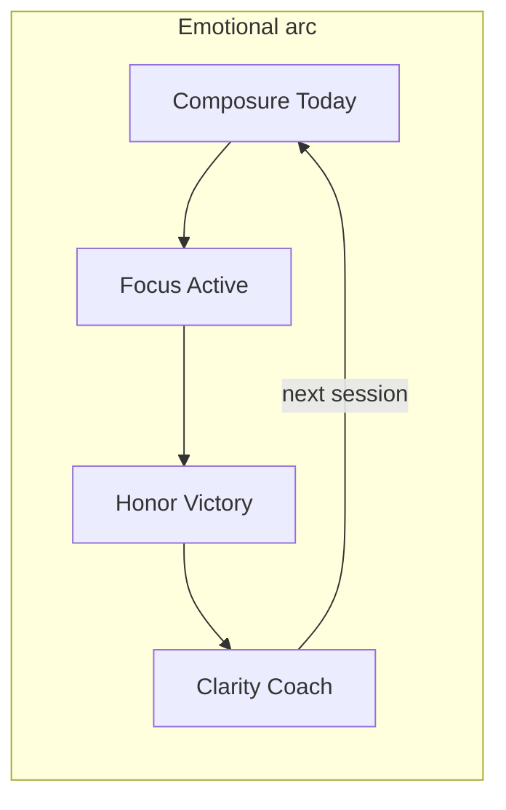

# Design Orchestration — Mission Winning

**Audience:** Design / Brand lane (agents + founder approve)  
**Product gates:** [ORCHESTRATION.md](../ORCHESTRATION.md) · **Status:** [CONTEXT.md](../CONTEXT.md) `## Now`  
**Companions:** [brand-guidelines.md](brand-guidelines.md) · [DESIGN_SYSTEM.md](DESIGN_SYSTEM.md) · [DESIGN_RESEARCH.md](DESIGN_RESEARCH.md) · [DESIGN_REVIEW.md](DESIGN_REVIEW.md) · [apps/android/UX.md](../apps/android/UX.md)

Use this file to decide **what design craft ships next** and **what is vanity until retention unlocks**. Do not replace the brand — refine execution.

---

## Where we are

Product status lives in [CONTEXT.md](../CONTEXT.md) `## Now`. Design craft waves below map onto product Horizons 0–3.

| Craft wave | Product horizon | Status |
|------------|-----------------|--------|
| **D0 Hero craft** | Horizon 0 | Shipped 2026-07-22 |
| **D1 Conversion craft** | Horizon 1 (founder override) | **Shipped 2026-07-22** — Landing / Welcome / Bundle |
| **D2 Retention emotion** | Horizon 2 (founder override) | **Shipped 2026-07-22** — Victory ritual · score coach-line · adapt glance |
| **D-prelaunch** | Pre-flip (founder excellence) | **Shipped 2026-07-22** — Today composure · Active intent · Victory one-exit · rest · gate · Android parity |
| **D3 Platform excellence** | Horizon 3 (founder override) | **Shipped 2026-07-22** — token sync · Fuel/Move/Mind/Learn CTA density · Batch C · guide chrome |
| **D4 Beta composure** | Horizon 0 (founder override) | **Shipped 2026-07-22** — Landing cut (~5–6 bands) · wedge copy · Bundle one-offer · Today More collapse · Android Today secondary demotion |

---

## North star (emotional design)

Mission Winning already owns a rare brand lane: **mission briefing** (navy / emerald / brass), free offline logger, log-based Mission Coach. Peers win on craft density (Hevy/Strong), one-CTA coach clarity (Freeletics), or metric calm (Bevel/WHOOP). We win by combining **Strong-class private logging + Freeletics-class adaptive coach + clinical honor** — never social feeds, wearable gates, or gym-bro confetti.

| Emotion | When | Expression |
|---------|------|------------|
| **Composure** | Open app / Today | Quiet briefing: mono eyebrow → display → one Start |
| **Focus under load** | Active | Range-card density; thumb never leaves set row; rest glanceable |
| **Earned honor** | PR / streak / Victory | Brass flash + haptic lock — rare, not decorative |
| **Trust** | Offline / free core | Honest “ON DEVICE” status; logger never paywalled |
| **Clarity** | Coach | One adapt line + week plan; no chat theater |

**Signature line users should feel:** *“I know exactly what to do next. When I finish, it felt earned.”*

**Anti-feelings:** dashboard anxiety, CTA competition, gamified theater, “everything app” overwhelm above the fold.

---

## Brand & system lock

Do not reinvent. Enforce:

| Layer | Source |
|-------|--------|
| Colors | Navy `#0a0c10` · Emerald `#27b07d` (action) · Brass `#c7a860` (honor only) — [brand-guidelines.md](brand-guidelines.md) |
| Type | Barlow Condensed · Inter · IBM Plex Mono |
| Web tokens | [`src/index.css`](../src/index.css) + [DESIGN_SYSTEM.md](DESIGN_SYSTEM.md) |
| Android tokens | [`MwColors`](../apps/android/core/designsystem/src/main/java/com/missionwinning/core/designsystem/MwColors.kt) · [`MwMotion`](../apps/android/core/designsystem/src/main/java/com/missionwinning/core/designsystem/MwMotion.kt) · [UX.md](../apps/android/UX.md) |
| Motion | 150 / 200–250 / 300–450ms; `prefers-reduced-motion` / `LocalReduceMotion` |
| Cards | ≤1 elevated + ≤1 glow per screen |

**Cross-platform rule:** Any token or motion change updates web CSS + Android `Mw*` + DESIGN_SYSTEM.md + UX.md in the **same** change set. Run `npm run check-token-sync` before ship to catch drift.

### Token sync checklist (D3)

Before any craft wave or Android release that touches colors/motion:

1. `npm run check-token-sync` — exit 0 (web `:root` HSL ↔ Android `MwColors` / `MwMotion`)
2. If drift: fix `src/index.css` and/or `MwColors.kt` / `MwMotion.kt` in the **same** PR
3. Update [DESIGN_SYSTEM.md](DESIGN_SYSTEM.md) token table if semantic names change
4. Log pass in [DESIGN_REVIEW.md](DESIGN_REVIEW.md) when D3 pillar surfaces ship

---

## Competitive positioning (steal / avoid / own)

Full matrices: [DESIGN_RESEARCH.md](DESIGN_RESEARCH.md) (Waves 1–7). Summary:

| Peer | Steal | Avoid | MW owns |
|------|-------|-------|---------|
| **Hevy / Strong** | Set table, previous-set ghost, 2-tap complete | Hevy blue, social PR feeds | Free forever + offline |
| **Freeletics** | One Start; light I-Day → plan | Hard paywall before logger value | Logger free without Coach lock-in |
| **Bevel / WHOOP** | Metric hierarchy + one insight line | Ring-dashboard clone; wearable home | Mission Score from **logs** |
| **NTC / Fitness+** | Discovery polish on Learn/Move later | Video chrome inside set row | Train stays table-first |
| **Linear / Arc** | Chrome recedes; match weight to task | Decorative card wallpaper | Briefing density on Today |
| **RepStack / Forge** | Next-set auto-seed; Just Go | Paywall progression / BYOK | Targets + Just Go stay free |

---

## Surface quality bars (pass/fail)

Every hero surface must pass before ship:

1. **One composition** — first viewport has one job
2. **One emerald CTA** above the fold
3. **Brass only if earned** this session/lifetime
4. **Tabular nums** on all metrics; no layout shift
5. **Empty = invite + CTA** (not void)
6. **Offline / free honesty** visible where relevant
7. **Emotion beat** explicit: composure | focus | honor | clarity

**Cadence:** hero pass before public flip + after each craft wave ([DESIGN_REVIEW.md](DESIGN_REVIEW.md)); quarterly full brand audit (pairs with a11y).

---

## Craft waves (horizon-gated)

### Wave D0 — Hero craft (Horizon 0 · now)

**Allowed:** unblock beta confusion, phone hero QA, docs, residual polish that helps week-4 measurement.  
**Forbidden:** landing teardown, new pillars, brand redesign.

| Track | Work | Key paths |
|-------|------|-----------|
| **Docs** | This file + INDEX / ORCHESTRATION Design lane | `docs/`, root INDEX |
| **Web Today** | Single boss CTA; demote QuickLinks below fold | `HomeTodayLean`, `HomeTodayDashboard`, `JourneyHero` |
| **Web Active** | Rest glanceability + PR brass chip inline; one-thumb next-set | `ActiveWorkoutPage`, `SetLogRow`, `RestTimerBar` |
| **Android** | Accept B re-walk; accept-blocker craft only | [FOUNDER_ACCEPT.md](../apps/android/FOUNDER_ACCEPT.md), [UX.md](../apps/android/UX.md) |
| **Review** | DESIGN_REVIEW pass; Issues = hero-only | [DESIGN_REVIEW.md](DESIGN_REVIEW.md) |

**Done when:** cold open → Start → complete set → Victory → Coach is emotionally coherent on phone (web + Android); no competing emerald CTAs on Today.

### Wave D1 — Conversion craft (Horizon 1 · public)

**Founder override 2026-07-22:** shipped before public flip (excellence-first).

| Surface | Excellence bar |
|---------|----------------|
| **Landing `/`** | Viewport 1: brand · one headline · one line · one CTA · product proof only |
| **Welcome / I-Day** | Cinematic briefing, not card wizard; 3 questions max |
| **Bundle** | Pillar synergy story before plan tabs; under-promise depth (REDTEAM) |
| **Gate / beta** | Wedge copy only |

### Wave D2 — Retention emotion (Horizon 2 · week-4 loop)

**Founder override 2026-07-22:** shipped before week-4 measurement (excellence-first). Kill criteria still apply post-launch.

| Beat | Ship |
|------|------|
| **Victory ritual** | Lock animation + volume truth + one next action (prefer Coach early sessions) — web + Android parity |
| **Today briefing voice** | Mission Score + **one coach line** under the number |
| **Coach adapt** | Banner readable at a glance; free vs Bundle depth already defined |
| **Kill if** | No retention lift after two cohorts → stop decoration ([ORCHESTRATION.md](../ORCHESTRATION.md) H2) |

### Wave D-prelaunch — Exquisite before flip (founder excellence)

**Founder override 2026-07-22:** ship before public / Accept B — returning-user density + in-session focus.

| Priority | Work |
|----------|------|
| **P0 Today** | Score + coach line above fold; rings/sparklines/muscle in collapsed Readiness |
| **P0 Victory** | One emerald next; History/Share quiet text |
| **P0 Active** | Mono session intent above logger; demote check-in chrome |
| **P0 Rest** | Oversized glanceable clock |
| **P1 Landing/Gate** | Product-hero presence; gate/beta briefing chrome |
| **P2 Android** | Today composure + rest/Victory honor parity |

### Wave D3 — Platform excellence (Horizon 3 · scale)

**Shipped under founder override 2026-07-22** (excellence-first; retention gate waived for token + pillar craft).

| Track | Work |
|-------|------|
| **Token sync** | `npm run check-token-sync` — [`scripts/check-token-sync.mjs`](../scripts/check-token-sync.mjs); web CSS ↔ Android `MwColors`/`MwMotion` |
| **Pillar surfaces** | Fuel FAB demotion; Move/Mind/Learn one-emerald CTA density |
| **SEO public chrome** | `/guide` briefing hierarchy + Start training CTA |
| **i18n Batch C** | Landing + Bundle IT/RU/KO/JA conversion depth |
| **iOS** | **Still deferred** until Android Phase 1 accepted; inherit this file + tokens ([IOS_PLAYBOOK.md](IOS_PLAYBOOK.md)) |

### Wave D4 — Beta composure (Horizon 0 · founder override)

**Founder override 2026-07-22:** investable website + beta-ready density without redesign.

| Track | Work |
|-------|------|
| **Landing** | Cut to ~5–6 bands; one emerald CTA (nav ghost); Train+Coach wedge only |
| **Copy** | Kill “everything app” / “all-in-one” on marketing + About + brand boilerplate |
| **Bundle** | One story + one offer; compare collapsed; no pillar tile / unlock farms |
| **Web Today** | QuickLinks + accordion under collapsed More |
| **Android Today** | Secondary cards base elevation; hero only elevated+glow |

---

## Web ↔ Android parity matrix

| Beat | Web | Android Compose |
|------|-----|-----------------|
| Today briefing | JourneyHero + Just Go | Today Start hero + Form score + coach line under (1.24+) |
| Logger | SetLogRow table | Current-set hero + MwRestDock |
| Victory | WorkoutVictorySheet lock + brass volume | Victory lock + brass volume line |
| Coach | Adapt banner (≤3 beats) + week | CoachAdaptBanner + week progress |
| Shell | 5 tabs + More | 3-tab hub (Today · Coach · Account); Active immersive |
| Offline | PWA / SW | Room SoT + MwOfflinePill |

**Parity rule:** emotion and tokens match; IA may differ (wedge Android vs full-pillar web). Never port web dashboard chrome onto Android Today.

---

## What “exquisite” looks like (acceptance)

1. **Open Today** — one sentence of intent, Mission insight optional, emerald Start. No KPI soup.
2. **Log a set** — previous ghost → steppers → Complete; emerald wash; brass only on PR.
3. **Rest** — oversized glanceable time; ±15s; never a blocking modal.
4. **Victory** — quiet lock, volume/PRs in brass, one clear next (Coach or Today).
5. **Landing** — could not belong to another brand after removing nav; product UI is the hero.

---

## Explicit non-goals

- Replacing navy/emerald/brass or purple/cream AI-default themes
- Becoming WHOOP/Bevel (wearable-first) or Hevy (social-first)
- Website or Android teardown during Horizon 0
- Gating logger, rest, PRs, or Just Go behind Bundle
- Confetti, streak theater, XP loot as retention

---

## Kill criteria (vanity vs retention)

| Signal | Action |
|--------|--------|
| Hero flow confusion in beta | Fix in D0 immediately |
| Polish with no week-4 movement (two cohorts) | Stop D2 decoration; cut to interviews |
| Token drift web ≠ Android | Block ship until same-change-set sync |
| Competing emerald CTAs above fold | Fail quality bar — do not ship |

---

## Agent rules

1. State lane **Design / Brand** up front; stay in allowed paths ([ORCHESTRATION.md](../ORCHESTRATION.md) departments).
2. Horizon 0: D0 only unless founder overrides with risk acceptance.
3. Log every hero pass in [DESIGN_REVIEW.md](DESIGN_REVIEW.md).
4. Update [CONTEXT.md](../CONTEXT.md) `## Now` + [LOG.md](../LOG.md) on ship.
