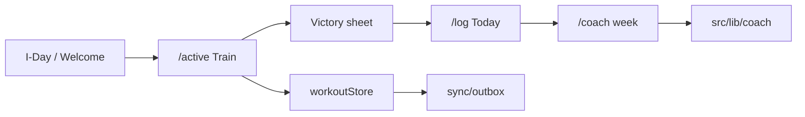

# Framework review — Mission Winning

**Audience:** Founder + agents  
**Date:** 2026-08-05  
**Horizon:** W (wedge excellence) — [ORCHESTRATION.md](../ORCHESTRATION.md) principle 5: *selective rebuild only; no framework rewrite*  
**Companion:** [ARCHITECTURE.md](ARCHITECTURE.md) · [PRODUCTION_STACK.md](PRODUCTION_STACK.md) · [FLOW_ARCHITECTURE.md](FLOW_ARCHITECTURE.md)

This is an evidence-backed fitness review of the **web PWA stack** (Next.js 16 + React 19), not a migration proposal. Android Compose is scored only at the shared-core boundary.

---

## Verdict

**Stay on Next 16 PWA + selective decompose.** The framework serves the Train → Today → Victory → Coach wedge. Complexity lives in fat modules and a few boundary leaks — not in the choice of Next/React/Zustand/Supabase.

| Area | Grade | One-liner |
|------|-------|-----------|
| Core stack currency | **Strong** | Next 16.3 · React 19.2 · Zod 4 · Zustand 5 · Serwist 9 · Tailwind 3 |
| Layering (routes → pages → hooks → lib → API) | **Strong with fat** | Coach folder is the model; logger/Today pages + store still dense |
| Gate-as-architecture | **Strong** | Storage, dates, outbox, tokens, i18n, bundle ratchet — paid for in blood |
| Bundler / PWA | **Deliberate debt** | Dev Turbopack · prod `--webpack` (Serwist) · SW off while `PRIVATE_MODE` |
| React Compiler | **Not adopted** | Compiler off; ~200 hand memos remain — fine for now |
| Shared core (`mw-core`) | **Thin wedge** | Seed + adaptSummary + victory CTA — not a full engine port |
| Ops layers 9 / 12 / 13 | **Partial** | Upstash / Sentry / backup still public-flip blockers |
| Rewrite pressure | **None** | No evidence the product is fighting Next |

---

## Stack inventory (resolved)

| Piece | Version | Role |
|-------|---------|------|
| `next` | 16.3.0 | App Router · `proxy.ts` gate · thin `app/(app)/` shells |
| `react` / `react-dom` | 19.2.8 | UI |
| `zustand` | 5.0.14 | Active workout only (`workoutStore`) |
| `zod` | 4.4.3 | `apiSchemas.ts` + route validation |
| `@serwist/next` | 9.5.x | Service worker (`app/sw.ts` → `public/sw.js`) |
| `@supabase/*` | 2.x / ssr 0.12 | Auth + selective cloud |
| `@sentry/nextjs` | 10.x | Wired when DSN set |
| `@upstash/*` | redis + ratelimit | Prod rate limits (unset → in-memory) |
| `tailwindcss` | 3.4.x | Design tokens; **not** Tailwind 4 |
| Android | Compose 1.24.1 | Separate lane — Train + Coach via API + Kotlin seed |

**Skew (hygiene, not blockers):**

- `eslint-config-next@16.2.7` and `@next/bundle-analyzer@16.2.10` trail `next@16.3.0`
- `eslint-config-next` is **declared but unused** — `eslint.config.js` is hand-rolled flat config
- `playwright` range `^1.51.1` vs `@playwright/test@1.61.1` (lockfile already 1.61.1)

---

## Architecture fit (hero path)

| Check | Finding |
|-------|---------|
| Thin routes | Live routes under `app/(app)/` import page-components — correct |
| Today split | `HomePage.tsx` (61) → `HomeTodayDashboard` (737) / `HomeTodayLean` (383) — composition fat; scoring already in `src/lib/today/` (~605 lines, healthy) |
| Train | Progressive extraction documented in `src/lib/workout/INDEX.md` (`.405`–`.425`); page still 686 + helpers 758 + store 745 |
| Coach | Decomposed domain folder (~3k lines across files); largest pieces ~330 lines — **model for other domains** |
| API shape | Thin example: `coach/chat`. Thick: mobile sync upserts + cron nudges still in-route |
| Premium | Server-decided via `premiumServer` + `/api/premium/status`; `mw_premium` only as **dev** fallback in `usePremium` |

**Horizon W excellence criteria** are product/UX gates (one-thumb log, boss CTA, earned coach week, shame-free re-entry, ≤90s phone hero). Framework does not block them; fat Train/Today surfaces are where craft time goes.

---

## Fat modules (selective rebuild targets)

Threshold used in the plan: ≥400 lines as a review flag (not a hard rule).

### Highest-leverage cluster — Train wedge

| Lines | Path | Owns |
|------:|------|------|
| 758 | `src/lib/workout/activeWorkoutHelpers.ts` | Next set, dials, console set, loadPct gates |
| 745 | `src/store/workoutStore.ts` | Templates, history, active session, rest, complete → outbox |
| 686 | `src/page-components/ActiveWorkoutPage.tsx` | Shell + set handlers + victory wiring |

Continue the existing extract waves (helpers already growing out of the page). Prefer **more lib + thinner page**, not a new state library.

### Composition fat (logic mostly extracted)

| Lines | Path | Note |
|------:|------|------|
| 737 | `HomeTodayDashboard.tsx` | Imports `src/lib/today/*`; still large React glue |
| 728 | `HistoryPage.tsx` | UI over `historyAnalytics` |
| 661 | `NutritionPage.tsx` | Shell + **outbox gap** (below) |

### Content blobs (low rewrite value)

| Lines | Path | Note |
|------:|------|------|
| 650 | `nlMealLog.ts` | Keyword catalog + matching |
| 520 | `formGuidesExtended.ts` | Static form-guide text |

### Hooks

Healthy — fattest `useCoachPlan.ts` at 184. No decompose urgency.

### Thick API routes (not page fat, still debt)

| Lines | Path | Issue |
|------:|------|-------|
| 377 | `app/api/cron/nudges/route.ts` | Multi-product cron sequencing in-route |
| 335 | `app/api/mobile/sync/workouts/route.ts` | Upsert + mapping inline; `requireUser` copied 4× |

---

## Boundary leaks (concrete)

### 1. Nutrition cloud writes bypass the outbox

`sync/INDEX.md` lists outbox kinds: workout, coach, journey, leaderboard, pft, … — **no nutrition**.

`NutritionPage.tsx` calls `saveNutritionEntry(...).catch(() => {})` (and Assessments misuse the same helper). Gym-wifi loss drops Fuel rows the way workouts used to before outbox.

**Verdict:** Harden — add `nutrition.upsert` (or equivalent) when signed-in cloud Fuel matters for beta. Horizon W prefers Train, but this is the same defect class the outbox was invented to kill.

### 2. `window.localStorage` bypasses the eslint gate

`eslint.config.js` restricts the **global** `localStorage` identifier, not `window.localStorage`.

| Path | Use |
|------|-----|
| `src/store/persistDedupe.ts` `browserStorage()` | Zustand persist — intentional SSR stand-in, but raw API |
| `src/lib/localeHttpLoader.ts` | `mw_locale_http` flag |

**Verdict:** Harden — route through `safeStorage` (or extend eslint to catch `window.localStorage` / `MemberExpression`).

### 3. Victory next-action — two homes

| Home | Notes |
|------|-------|
| `packages/mw-core/src/workout/victory.ts` | Expo / portable CTA |
| `src/lib/workout/workoutVictory.ts` | Web — **extra** `week1SecondSessionCue` |

`adaptSummary` is the good pattern (web re-exports mw-core). Victory drifted.

**Verdict:** Decompose toward one definition — web should re-export mw-core + thin wrap for week-1 cue, or move the cue into mw-core.

### 4. Mobile sync `requireUser` × 4

Identical helpers in `workouts` / `routines` / `customs` / `prefs` routes.

**Verdict:** Decompose — one `mobileSyncAuth.ts` (or shared `*Server`).

### 5. Android seed mirror

`LocalCoachSeed.kt` mirrors `mw-core` `createSeedCoachPlan`. Documented; Android does **not** import the TS package (by design — no planEngine on device).

**Verdict:** Keep — accept duplication until a codegen or shared JSON seed is worth it. Do not port `planEngine` from Android lane.

---

## Framework / dependency fitness

### Why `next build --webpack`

Next 16 defaults production builds to Turbopack. `@serwist/next` injects a webpack plugin → Turbopack prod build fails. House split: **`next dev` (Turbopack)** + **`next build --webpack`**. Empty `turbopack: {}` in `next.config.js` satisfies Next 16’s config location. Gate/CI set `PRIVATE_MODE=false` so the SW compiles for offline e2e.

### React Compiler

Not enabled (`babel-plugin-react-compiler` absent; no `reactCompiler` in next config). Manual `useMemo`/`useCallback` still common (~128 / ~73 matches). React 19 APIs (`useEffectEvent`, `useDeferredValue`) almost unused.

**Verdict:** Defer — enabling the compiler is a focused experiment PR later, not Horizon W critical path.

### i18n

Migration to `src/i18n/` is **complete in code** (`src/locales/` gone from disk). Doc strings still say “deprecated” in places — cleanup only.

### Security ratchet

`npm run security-audit`: **9** distinct high advisories present, **13** allowlisted. Script warns to drop 4 cleared GHSAs (postcss / sharp / brace-expansion) and lower `MAX_ACCEPTED_HIGH`. Remaining highs are mostly Phantom/Solana graph — accepted with reasons in `SECURITY_AUDIT_TRIAGE.md`.

**Verdict:** Harden — ratchet cleanup is a small PR that locks a real gain (`.489`/`.491` already cleared postcss).

### CSP

`next.config.js` still allows `'unsafe-inline'` + `'unsafe-eval'` on `script-src`. Report/enforce toggled via env. Known tradeoff — do not “fix” without a dedicated CSP wave.

---

## Ops scorecard (framework-adjacent)

Refresh against [PRODUCTION_STACK.md](PRODUCTION_STACK.md) + CONTEXT Status (2026-08-05):

| Layer | Status | Framework note |
|-------|--------|----------------|
| 1 Frontend | Strong | This review |
| 2 APIs | Strong | Extract thick mobile sync / cron |
| 3–5, 7–8 | Strong | Unchanged |
| 9 Rate limit | Partial | Upstash **unset** in prod |
| 10 Cache / PWA | Partial | SW disabled while `PRIVATE_MODE` — offline unvalidated in real beta |
| 12 Errors | Partial | Sentry DSN **unset** |
| 13 Recovery | Partial | Backup runbook exists; drill founder-owned |

**PWA realism:** CI builds with `PRIVATE_MODE=false` exercise Serwist; production private gate does not. That is product policy, not a Serwist defect. Offline excellence cannot be beta-validated until public flip.

---

## Testing fitness

| Layer | Fit |
|-------|-----|
| Unit guards | Backbone — `launchTruth`, storage, outbox, bundle, security ratchet, private gate |
| Route contracts | Only **4** `*.routetest.ts` — intentional thin set; expand when adding thick route logic |
| E2E `@gate` | Hero path; offline needs SW-enabled build |
| Visual | Dark — no Linux baselines (CONTEXT) |

Guards follow house rules (discover, don’t enumerate; falsify mutants). Framework concerns are better covered by unit guards than by more e2e.

---

## Ranked backlog (≤10)

Ordered for Horizon W + public-flip prep. Each item is roughly one PR.

| # | Item | Verdict | Horizon | Why now |
|---|------|---------|---------|---------|
| 1 | Continue Train extract: thin `ActiveWorkoutPage` / grow helpers or hooks from set-handler bodies | Decompose | W | Densest wedge cluster; waves already started |
| 2 | Nutrition → durable outbox (or explicit “local-only until signed-in sync”) | Harden | W / 0 | Same defect class as pre-outbox workouts |
| 3 | Close `window.localStorage` policy hole (`persistDedupe`, `localeHttpLoader` + eslint) | Harden | W | Gate that cannot see the bypass is theater |
| 4 | Unify Victory: web re-export mw-core + week-1 wrap (or move cue into mw-core) | Decompose | W | `.178` two-homes risk on habit-loop CTA |
| 5 | Extract mobile sync `requireUser` + workout upsert helpers from routes | Decompose | 0 | Android sync correctness; thinner handlers |
| 6 | Security-audit allowlist ratchet (drop 4 cleared GHSAs; lower cap) | Harden | 0 | Locks `.489` gain; script already complains |
| 7 | Align `eslint-config-next` / bundle-analyzer to next 16.3 **or** remove unused eslint-config-next | Keep/Harden | 0 | Hygiene |
| 8 | Doc the webpack/Serwist build split in ARCHITECTURE or CONTRIBUTING (one paragraph) | Keep | W | Agents re-discover this every cold start |
| 9 | Today dashboard: extract remaining orchestration into hooks (`useTodayDashboard`) without UI redesign | Decompose | W | Only if phone dogfood names Today as friction |
| 10 | React Compiler experiment | Defer | 2+ | No wedge payoff until memo pain is measured |

### Explicit non-goals

- Rewrite to Remix / Vite SPA / Tailwind 4 / RSC-everything
- Port `planEngine` into Android or swell `mw-core` into a full engine
- Enable React Compiler as a big-bang
- New pillars / locales / America / iOS
- Flipping `PRIVATE_MODE` or inventing traction

---

## Decision rubric (reuse)

| Verdict | Action |
|---------|--------|
| **Keep** | Document only |
| **Harden** | Small PR + test / ratchet |
| **Decompose** | Split behind same API |
| **Defer** | Log; do not start |
| **Reject** | Implies rewrite or new pillar — stop |

---

## How to use this doc

1. Founder: accept “stay on Next 16 + selective decompose” or override with a named rewrite goal.
2. Agents: pick from the ranked backlog; one concern per PR; do not open a “framework migration” epic.
3. When a backlog item ships, strike it here or move detail to LOG — keep this file as the living scorecard, not a changelog.

**Related:** [ARCHITECTURE.md](ARCHITECTURE.md) · [PRODUCTION_STACK.md](PRODUCTION_STACK.md) · [ORCHESTRATION.md](../ORCHESTRATION.md) · `src/lib/workout/INDEX.md` · `src/lib/sync/INDEX.md` · `packages/mw-core/INDEX.md`
