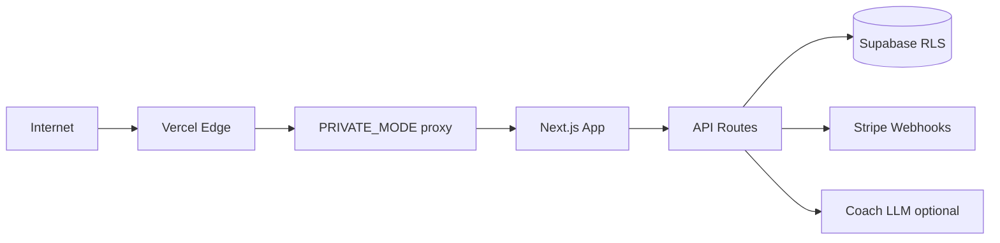

# OWASP Security Audit — Mission Winning

**Last audit:** 2026-07-05 (full sweep) · **Refresh:** 2026-07-16 (red-team plan + residual risks). Living companion to [PROTECTION.md](../PROTECTION.md).

---

## Executive summary

Mission Winning ships with a **defense-in-depth** posture appropriate for private beta:

- Private gate (`proxy.ts`) with signed cookies and rate-limited password form
- Payment webhooks verified (Stripe HMAC, PayPal REST)
- Premium content server-gated; `DEMO_PREMIUM` refused in production builds
- Supabase RLS + column-level revoke on `teacher_pin`
- Security headers + CSP (production)

This sweep closed **Critical/High** code findings from the 2026-07-05 audit and added automated smoke + dependency audit in CI.

---

## Threat model (simplified)



**Trust boundaries:** Browser (untrusted), API routes (validate + rate limit), service role (webhooks/admin only).

---

## OWASP Top 10 (2021) — status

| ID | Category | Status | Notes |
|----|----------|--------|-------|
| A01 | Broken Access Control | **Fixed** | School stats/leaderboard require teacher PIN or creator; premium via admin enrollment check |
| A02 | Cryptographic Failures | **Fixed** | Youth consent + nudge secrets fail-closed in prod; no default HMAC in prod |
| A03 | Injection | **Low risk** | React escaping; JSON-LD static; Zod on API bodies |
| A04 | Insecure Design | **Improved** | LLM/fuel endpoints rate-limited; coach APIs require gate cookie or session |
| A05 | Security Misconfiguration | **Improved** | `DEMO_PREMIUM` blocked in prod; `?access=` query bypass off in prod by default |
| A06 | Vulnerable Components | **Monitored** | `npm audit --audit-level=high` in CI (soft fail); Solana/Phantom graph triaged in [SECURITY_AUDIT_TRIAGE.md](SECURITY_AUDIT_TRIAGE.md); Serwist replaced next-pwa |
| A07 | Auth Failures | **Improved** | PIN/consent rate limits; JWT bypass uses `getUser()` not payload decode |
| A08 | Data Integrity | **Low** | Backup restore schema-checked client-side |
| A09 | Logging | **Partial** | Server errors logged; no centralized SIEM |
| A10 | SSRF | **Low** | Outbound fetch to fixed OFF URLs only |

---

## Verification commands

```bash
# Unit tests (includes security helpers)
npm test

# Perimeter smoke (deployed or local prod server)
SMOKE_BASE_URL=https://www.missionwinning.com npm run security-smoke

# Supabase migration checklist
node scripts/verify-supabase-security.mjs

# Stripe enrollment shape
node scripts/verify-stripe-enrollment.mjs

# Dependency audit
npm run security-audit
```

### Manual curls (from PROTECTION.md)

```bash
# Premium APIs reject anonymous
curl -sI https://www.missionwinning.com/api/premium/recipes

# Webhook forgery rejected
curl -X POST https://www.missionwinning.com/api/stripe-webhook \
  -H 'Content-Type: application/json' -d '{}'

# School IDOR closed
curl -sI https://www.missionwinning.com/api/school/class/MWTEST/leaderboard
```

---

## Founder checklist (before `PRIVATE_MODE=false`)

1. Rotate secrets: `PRIVATE_ACCESS_SECRET`, `YOUTH_CONSENT_SECRET`, `NUDGE_SECRET`, `CRON_SECRET`, `BETA_ADMIN_SECRET`
2. Vercel Production: `DEMO_PREMIUM=false`, `PRIVATE_ALLOW_AUTH_BYPASS` unset, `PRIVATE_ALLOW_QUERY_ACCESS` unset
3. **Required before public:** `UPSTASH_REDIS_REST_URL` + `UPSTASH_REDIS_REST_TOKEN` ([PRODUCTION_STACK.md](PRODUCTION_STACK.md) L9)
4. **Required before public:** `NEXT_PUBLIC_SENTRY_DSN` on Production (L12)
5. Apply all `supabase/migrations/` including `20260702_security_hardening.sql` and `20260705_leads_api_only.sql`
6. Run `npm run security-smoke` + `npm run rate-limit-smoke` against production
7. Submit sitemap in Search Console ([SEO_ANALYTICS.md](SEO_ANALYTICS.md))
8. Optional but recommended: Aikido CI secret + Cursor login ([AIKIDO.md](AIKIDO.md)) — CRITICAL dependency gate on `master`

---

## Accepted risks / backlog

| Item | Rationale |
|------|-----------|
| CSP `unsafe-inline` / `unsafe-eval` | Still required by Next.js client runtime; Serwist migration shipped but CSP not fully locked down |
| In-memory rate limit fallback | **Local/dev only.** Production without Upstash is a Medium risk until Wave A closes it ([PRODUCTION_STACK.md](PRODUCTION_STACK.md)) |
| Coach taster localStorage reset | Product abuse only — premium LLM server-gated |
| Solana/Phantom high advisories | Required for lifetime crypto checkout; ownership + amount server-enforced — see [SECURITY_AUDIT_TRIAGE.md](SECURITY_AUDIT_TRIAGE.md); map Aikido SCA hits here |
| Soft CI dependency audit | Soft until crypto path removed or upstream clean; Aikido CRITICAL-deps gate is separate ([AIKIDO.md](AIKIDO.md)) |
| No SIEM | A09 partial — rely on Vercel/Supabase logs + weekly enrollment review post-public |

## Residual risks (2026-07-16 red-team)

| Risk | Severity | Mitigation next |
|------|----------|-----------------|
| Founder secrets not rotated on prod | Critical if true | Founder S0 checklist |
| Multi-instance rate-limit bypass | Medium | Upstash env |
| Crypto checkout less mature than Stripe | Medium | Session + intent ownership + on-chain verify (shipped); keep optional |
| Public flip expands surface | High if flip without S3 | [PUBLIC_FLIP_CHECKLIST.md](archive/PUBLIC_FLIP_CHECKLIST.md) + security-smoke |
| Youth/school legal surface | High if misconfig | Re-verify secrets + PIN tests before school marketing |

## API inventory

Living matrix: [app/api/INDEX.md](../app/api/INDEX.md).

---

## Related docs

- [PROTECTION.md](../PROTECTION.md) — implementation log + curl checklist
- [SECURITY_AUDIT_TRIAGE.md](SECURITY_AUDIT_TRIAGE.md) — npm audit accept/fix
- [ENV.md](../ENV.md) — secret inventory
- [docs/archive/BETA_LAUNCH_OPS.md](archive/BETA_LAUNCH_OPS.md) — launch gates
- [PUBLIC_FLIP_CHECKLIST.md](archive/PUBLIC_FLIP_CHECKLIST.md) — post-public smoke
