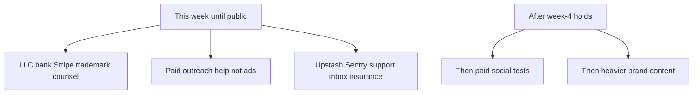

# Pre-launch capital focus (unlimited funds)

**Audience:** Founder  
**Verdict:** Buy readiness and distribution leverage. Do **not** buy vanity growth.  
**Not legal/tax advice.**  
**Companions:** [LLC_AND_PAYMENTS.md](LLC_AND_PAYMENTS.md) · [PRE_REVENUE_CHECKLIST.md](PRE_REVENUE_CHECKLIST.md) · [PAY_READY_LEGAL.md](PAY_READY_LEGAL.md) · [PRODUCTION_STACK.md](PRODUCTION_STACK.md) · [OUTREACH_VA_BRIEF.md](OUTREACH_VA_BRIEF.md) · [SOCIAL_LAUNCH.md](SOCIAL_LAUNCH.md) · [ACCELERATOR_SPRINT.md](ACCELERATOR_SPRINT.md)

Unlimited cash does **not** unlock paid ads before week-4 retention ([SOCIAL_LAUNCH.md](SOCIAL_LAUNCH.md), [STRATEGY.md](STRATEGY.md)). It makes that trap more expensive.

---

## Tier A — Spend now (unblock launch + applications)

| Spend | Status owner | Checklist |
|-------|--------------|-----------|
| LLC + EIN + business bank | Founder | [LLC_AND_PAYMENTS.md](LLC_AND_PAYMENTS.md) §1 |
| Attorney review Terms / Privacy / Refunds | Founder | [LLC_AND_PAYMENTS.md](LLC_AND_PAYMENTS.md) §1b · live `/terms` `/privacy` `/refunds` |
| Trademark search + USPTO filing (“Mission Winning”) | Founder | [LLC_AND_PAYMENTS.md](LLC_AND_PAYMENTS.md) §1c |
| Support mailbox `support@` | Founder | Before charging anyone |
| Cyber liability quote | Founder | [PAY_READY_LEGAL.md](PAY_READY_LEGAL.md) — bind before school/enterprise |
| Wave A ops (Upstash, Sentry, backup) | Founder env + verify scripts | § Wave A below |
| Outreach VA 10–20h | Founder hire | [OUTREACH_VA_BRIEF.md](OUTREACH_VA_BRIEF.md) — **no ad buying** |
| Accelerator relocation reserve | Founder | Hold cash; do not pre-rent |

---

## Tier B — Light brand & social (capped)

| Do | Do not |
|----|--------|
| One vertical (TikTok **or** Reels); film 60s demo; ≤1 post/week in beta | Daily posting agency; LinkedIn company page; Discord; YouTube long-form |
| Existing `/press` + brand guidelines | Full agency rebrand / “everything app” campaign |
| Product Hunt / Show HN on flip day (founder voice) | Paying for upvotes |
| Creator micro-sponsors **after** public + real week-1 activation | Large influencer retainers pre-traction |

---

## Tier C — Do **not** fund pre-launch

- Paid Meta/TikTok/Google ads until week-4 retained weekly loggers hold  
- Native iOS/Android before week-4 / A1 falsified  
- Cardano / Web3 rebuild for Draper  
- Agency growth stack (content farms, mass i18n, six-pillar creatives)  
- Vanity billboards / conference booths  
- Fake waitlists / purchased users (kills accelerator integrity)

---

## Budget shape (illustrative)

| Bucket | Share | Intent |
|--------|-------|--------|
| Entity + counsel + trademark + insurance | ~40% | Irreversible readiness |
| Ops (Upstash/Sentry/email/tools) | ~10% | Public reliability |
| Human outreach (VA) | ~25% | Users for applications |
| Content (you film; light edit) | ~10% | Demo + social |
| Reserve for accelerator relocation | ~15% | Optionality |
| Paid ads | **0% until week-4** | Discipline |

---

## Wave A — ops before public flip (founder)

Copy also lives in [ACCELERATOR_SPRINT.md](ACCELERATOR_SPRINT.md). Agents never set Production secrets or flip `PRIVATE_MODE`.

| Check | How | Done |
|-------|-----|------|
| Upstash | Vercel Production: `UPSTASH_REDIS_REST_URL` + `UPSTASH_REDIS_REST_TOKEN` | ⬜ |
| Rate-limit smoke | `SMOKE_BASE_URL=https://www.missionwinning.com npm run rate-limit-smoke` → sees 429 | ⬜ |
| Sentry | Production `NEXT_PUBLIC_SENTRY_DSN`; one intentional API error visible | ⬜ |
| Backup drill | Run [BACKUP_RESTORE.md](BACKUP_RESTORE.md) once | ⬜ |
| Support inbox | `support@missionwinning.com` (or hello@) live; knows `/refunds` | ⬜ |
| After flip | `SMOKE_ALLOW_PUBLIC=true SMOKE_EXPECT_PWA=true npm run launch-verify` | ⬜ |

Full scorecard: [PRODUCTION_STACK.md](PRODUCTION_STACK.md).

---

## Sequence (next 14 days)

1. **Today–Jul 22:** LLC path + trademark search + counsel kickoff; brief VA ([OUTREACH_VA_BRIEF.md](OUTREACH_VA_BRIEF.md)); film demo (`npm run seed-coach-adapt-demo`)  
2. **Jul 23–24:** CDL application; counsel review in flight  
3. **Jul 24–25:** Founder public flip after Wave A + beta gates  
4. **Jul 25–Aug 2:** Organic launch + YC/EG/SPC — **no paid ads**  
5. **Post week-4:** If retention ≥10%, unlock small paid tests ($1–2k) with wedge creative only  

---

## What money does / does not buy

**Buys:** legal entity for Stripe, trademark insurance, outreach hands, public reliability.  
**Does not buy:** week-4 retention, accelerator selection, or a substitute for founder athlete conversations and a 60s Coach demo ([applications/](applications/)).

Last updated: 2026-07-20
