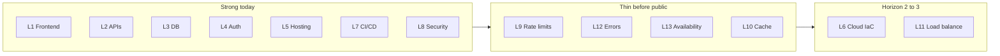

# Production Stack — 13 Layers

**Audience:** Founder + agents  
**Rule:** Knowing the list is not enough — each layer must be **built and operated**.  
**Horizon:** Ops maturity only. Do not expand product pillars under this doc ([ORCHESTRATION.md](../ORCHESTRATION.md)).

Most vibe-coded apps ship **two** layers (UI + database). A real product needs **thirteen**. Mission Winning already exceeds a demo stack (Vercel + Supabase + CI + RLS + premium gates). This page scores what is real vs thin, and defines done for *this* product.

---

## Scorecard (2026-07-20)

| # | Layer | Status | Owner | Evidence | Gap / next |
|---|-------|--------|-------|----------|------------|
| 1 | Frontend foundations | **Strong** | Agent | Next/React/Zustand, design system, e2e | PWA offline gated until `PRIVATE_MODE=false` |
| 2 | APIs / backend logic | **Strong** | Agent | `app/api/`, `src/lib/`, Zod, `withApiLogging` | Free-core still local-first by design |
| 3 | Database / storage | **Strong** | Both | Supabase migrations + selective sync | Anonymous users: client backup only → [BACKUP_RESTORE.md](BACKUP_RESTORE.md) |
| 4 | Auth / permissions | **Strong** | Both | Supabase auth, private gate, premium server checks | Founder secret hygiene ([PROTECTION.md](PROTECTION.md)) |
| 5 | Hosting / deployment | **Strong** | Founder | Vercel + `deploy-production.yml` + launch-verify | GitHub `VERCEL_*` secrets for auto Production |
| 6 | Cloud / compute | **Partial** | — | PaaS (Vercel/Supabase/Upstash/Resend) | No IaC — deferred until multi-env pain |
| 7 | CI/CD / version control | **Strong** | Both | `.github/workflows/ci.yml` (PR gate), `ci-extended.yml`, `dependency-review.yml`, CodeQL default setup (every PR), `deploy-production.yml` | Soft smoke in CI extended unless `SMOKE_BASE_URL` set |
| 8 | Security / RLS | **Strong** | Both | [PROTECTION.md](PROTECTION.md), OWASP, RLS migrations | Finish remaining P0s before public |
| 9 | Rate limiting | **Partial** | Founder | [src/lib/rateLimit.ts](../src/lib/rateLimit.ts) | **Upstash required in Production before public** |
| 10 | Caching / CDN | **Partial → v1** | Both | [CACHE_LADDER.md](CACHE_LADDER.md): browser private + enrollment Redis + static CDN | SW still gated by `PRIVATE_MODE`; no shared CDN for premium APIs |
| 11 | Load balancing / scaling | **Partial** | — | Serverless auto-scale | Capacity runbook deferred to Horizon 3 |
| 12 | Error tracking / logs | **Partial** | Founder | Sentry + `withApiLogging` | **`NEXT_PUBLIC_SENTRY_DSN` required in Production before public** |
| 13 | Availability / recovery | **Partial** | Both | Client backup + managed DB | Runbook: [BACKUP_RESTORE.md](BACKUP_RESTORE.md) |

**Verdict:** Layers 1–5, 7–8 are built. Layers **9, 12, 13** (and light **10**) separate private-beta ops from an honest public product. Layers **6** and **11** stay deferred.

---

## Definition of Done (per layer)

| Layer | DoD for Mission Winning |
|-------|-------------------------|
| 1 | App shell + hero e2e green; design tokens documented |
| 2 | Routes inventoried in `app/api/INDEX.md`; Zod on mutating APIs; `withApiLogging` on premium/hot paths |
| 3 | Migrations applied in prod; RLS on user tables; sync paths tested for signed-in users |
| 4 | Gate + Supabase session + premium 403 without enrollment; `DEMO_PREMIUM=false` in Production |
| 5 | Production deploy from `master`; Profile build label matches `buildInfo.ts` |
| 6 | *(Deferred)* Stay on PaaS; no Terraform until second env requires it |
| 7 | CI blocking: lint, typecheck, unit, build, `e2e:critical` |
| 8 | PROTECTION P0 checklist green; OWASP accepted risks documented |
| 9 | Production has Upstash URL+token; `npm run rate-limit-smoke` against prod returns 429 on hot route |
| 10 | After public flip: `SMOKE_EXPECT_PWA=true` launch-verify green; Today/Train usable offline once; enrollment Redis memo live when Upstash set ([CACHE_LADDER.md](CACHE_LADDER.md)) |
| 11 | *(Deferred)* Platform defaults until week-4 retention proves scale need |
| 12 | Production `NEXT_PUBLIC_SENTRY_DSN` set; one intentional API error visible in Sentry |
| 13 | [BACKUP_RESTORE.md](BACKUP_RESTORE.md) published; Profile export/import verified once; RPO/RTO stated |

---

## Wave A — Must before `PRIVATE_MODE=false`

### Founder-owned

| Item | Where | Verify |
|------|-------|--------|
| Upstash Redis (L9) | Vercel Production: `UPSTASH_REDIS_REST_URL`, `UPSTASH_REDIS_REST_TOKEN` | `SMOKE_BASE_URL=… npm run rate-limit-smoke` → sees 429 |
| Sentry DSN (L12) | Vercel Production: `NEXT_PUBLIC_SENTRY_DSN` (+ optional `SENTRY_AUTH_TOKEN` for source maps) | Trigger caught API error → event in Sentry project |
| Deploy secrets (L5/L7) | GitHub Actions: `VERCEL_TOKEN`, `VERCEL_ORG_ID`, `VERCEL_PROJECT_ID` | `deploy-production.yml` deploys Production (not Preview-only) |
| Post-deploy smoke (L7) | GitHub / local: `SMOKE_BASE_URL`, `SMOKE_ACCESS_SECRET` | `npm run gate-smoke` / `launch-verify` against www |
| Supabase restore drill (L13) | Dashboard once | Follow [BACKUP_RESTORE.md](BACKUP_RESTORE.md) operator path |

**Agents never mark founder env work done.**

### Agent-owned (this doc + scripts)

- Keep this scorecard honest when layers change.
- `scripts/rate-limit-smoke.mjs` — prove 429 on `/api/leads` when base URL is set.
- Backup/restore runbook text + INDEX links.
- In-memory rate-limit fallback = **local/dev only**; Production without Upstash is an accepted OWASP risk until Wave A closes it.

---

## Wave B — Flip day / early public

| Item | Layer | Action |
|------|-------|--------|
| PWA / Serwist | 10 | Set `PRIVATE_MODE=false` → rebuild enables SW (`next.config.js`); smoke with `SMOKE_EXPECT_PWA=true` |
| Security P0s | 8 | Finish remaining [PROTECTION.md](PROTECTION.md) P0 boxes (secrets already rotated where LAUNCH_RUNBOOK checked) |
| Offline spot-check | 10 | Today + Train once with network off after install |

---

## Explicitly deferred

| Layer | Why deferred |
|-------|----------------|
| 6 Cloud / IaC | Single PaaS stack is enough pre-PMF |
| 11 Load balancing / multi-region | Serverless defaults; revisit Horizon 3 |
| 12 SIEM / log aggregation | Sentry + Vercel logs sufficient pre-PMF |
| Full media CDN | Only if Learn/Mind media weight is measured pain |

---

## Related

| Doc | Role |
|-----|------|
| [BACKUP_RESTORE.md](BACKUP_RESTORE.md) | L13 user + operator recovery |
| [CACHE_LADDER.md](CACHE_LADDER.md) | L10 cache ladder — enrollment Redis + private browser cache |
| [LAUNCH_RUNBOOK.md](LAUNCH_RUNBOOK.md) | Founder critical path |
| [PROTECTION.md](PROTECTION.md) | Security P0–P2 |
| [ENV.md](ENV.md) | Env var reference (Upstash, Sentry, smoke) |
| [../ORCHESTRATION.md](../ORCHESTRATION.md) | Horizon gates |
| [VERCEL_DEPLOY_CHECKLIST.md](VERCEL_DEPLOY_CHECKLIST.md) | Deploy checklist |
| [OWASP_AUDIT.md](OWASP_AUDIT.md) | Accepted risks (incl. in-memory rate limit) |
