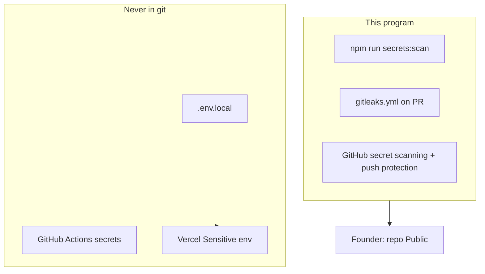

# Secrets Program — Mission Winning

**Audience:** Founder + contributors  
**Canonical for:** what must never enter git, where runtime secrets live, pre-public scrub, rotate-on-leak  
**Related:** [OPEN_SOURCE.md](OPEN_SOURCE.md) · [ENV.md](ENV.md) · [PROTECTION.md](PROTECTION.md) · [SECURITY.md](../SECURITY.md)

This is the lightweight operator program for open source. Runtime vaults stay **GitHub Actions secrets + Vercel env** — no Infisical/Doppler/Vanta required.



---

## Never commit

| Class | Examples |
|-------|----------|
| API / service keys | `SUPABASE_SERVICE_ROLE_KEY`, `STRIPE_SECRET_KEY`, `COACH_LLM_API_KEY`, `MEAL_VISION_API_KEY`, Resend, PayPal |
| Gate / HMAC secrets | `PRIVATE_ACCESS_SECRET`, `CRON_SECRET`, `NUDGE_SECRET`, `SMOKE_ACCESS_SECRET` |
| Deploy credentials | `VERCEL_TOKEN`, Deploy Hook URLs, GitHub PATs |
| Infra IDs in docs | Real `VERCEL_ORG_ID` / `VERCEL_PROJECT_ID`, Supabase project ref/URL (use placeholders in docs) |
| Personal PII | Founder personal email, phone, home address |
| Crypto material | Treasury **private** keys / keystore paths (`*.b58`, PEM, Android upload keystore) |
| User data dumps | Production DB exports, beta email lists |

`.env`, `.env*.local`, `.env.vercel.production`, `*.pem`, and Android keystores are gitignored — keep them that way.

---

## Allowed in the public tree

| Item | Why |
|------|-----|
| Brand mail | `support@missionwinning.com`, `hello@missionwinning.com` |
| Source URL | `https://github.com/Snedz/missionwinning` (AGPL §13) |
| Placeholders | `.env.example` values like `sk_live_...`, `price_...`, `YOUR-PROJECT` |
| Public product copy | Legal pages, help, architecture |

---

## Where secrets live (names only in git)

| Store | Use |
|-------|-----|
| **Vercel** → Project → Environment Variables | Production + Preview app env (Sensitive for service role / Stripe / LLM) |
| **GitHub** → Settings → Secrets and variables → Actions | `VERCEL_TOKEN`, `VERCEL_ORG_ID`, `VERCEL_PROJECT_ID`, smoke secrets, optional `AIKIDO_SECRET_KEY` |
| **Local** `.env.local` | Dev only — never commit; copy from `.env.example` |

Sync helper (names in ENV, values only in GH secrets): [ENV.md § Sync via GitHub](ENV.md), `npm run sync-vercel-env`.

---

## Scan before you push

```bash
npm run secrets:scan
```

Requires [gitleaks](https://github.com/gitleaks/gitleaks) on `PATH` (`brew install gitleaks`) **or** Docker. The script prefers the binary, then `docker run`, and exits non-zero with install hints if neither is available.

CI: [`.github/workflows/gitleaks.yml`](../.github/workflows/gitleaks.yml) on **pull_request** + `workflow_dispatch` (not on every `master` push). While Actions billing is blocked, treat the local scan as the gate (`npm run gate` does not replace this — run `secrets:scan` separately before a public flip).

Config: [`.gitleaks.toml`](../.gitleaks.toml) allowlists intentional placeholders.

**History:** Scrubbing the current tree does not erase old commits. Before flipping Public, run once:

```bash
gitleaks detect --source . -v
```

If history still contains `.env.local.save` or similar, **rotate** any credentials that appeared there (even anon JWTs), then decide with counsel whether a history rewrite is worth it. Full rewrite is **out of scope** by default.

Day-to-day `npm run secrets:scan` uses `--no-git` (working tree only) and allowlists gitignored `.env.local` / build dirs — it is not a substitute for the history scan above.

---

## Rotate-on-leak checklist

1. **Revoke / rotate** the credential at the provider (Stripe, Supabase, Vercel, xAI, etc.).
2. Update **Vercel** Production + Preview and **GitHub Actions** secrets.
3. Redeploy Production (Deploy Hook or Actions → Deploy production).
4. Search the tree: `rg -n 'fragment_of_secret' .` and scrub any doc that copied it.
5. If the leak was in a public commit, treat disclosure per [SECURITY.md](../SECURITY.md).

---

## Pre-public flip (founder-only)

Agents **never** change repository visibility or flip `PRIVATE_MODE`.

1. [ ] `npm run secrets:scan` clean on current tree  
2. [ ] Optional: `gitleaks detect --source . -v` on history  
3. [ ] Confirm scrub: no personal gmail, real Vercel org/project IDs, Supabase ref, treasury private-key paths in docs  
4. [ ] Note `docs/applications/` becomes world-readable with the repo  
5. [ ] GitHub → Settings → **Code security** → enable **Secret scanning** + **Push protection** (free on public repos)  
6. [ ] Optional: enable Code scanning (CodeQL workflow is schedule/dispatch only)  
7. [ ] GitHub → Settings → **Change repository visibility → Public**  
8. [ ] Do **not** flip `PRIVATE_MODE` as part of going open source  

See [OPEN_SOURCE.md](OPEN_SOURCE.md).
